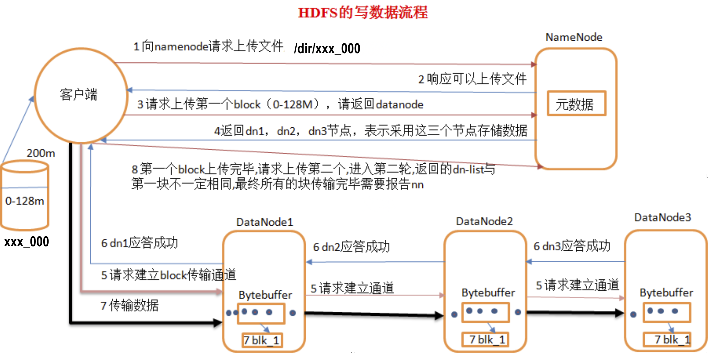
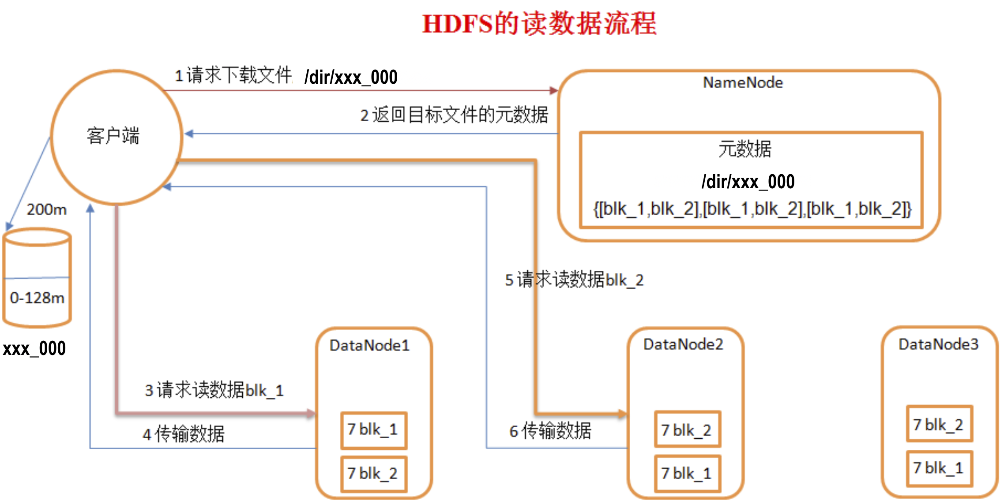
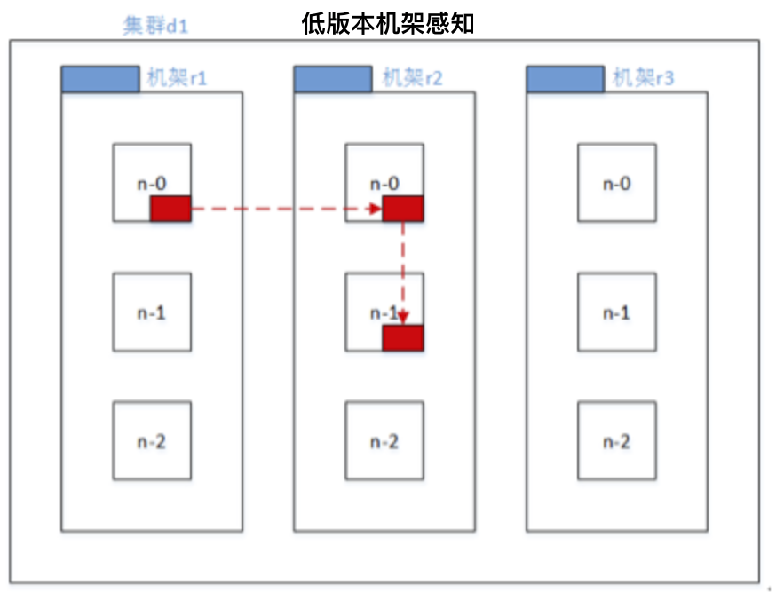

是什么？
```
 1）HDFS 是一个文件系统,用于存储文件,通过层级目录树定位文件;其次,是分布式存储的,由多台服务器联合使用,各自承担不同角色,完成系统集群功能.
 2）HDFS的设计适合一次写入,多次读出常见,有编辑文件的操作,但一般不推荐使用,因为hdfs是被定位为数据仓库,而非数据加工工厂.因此HDFS适合数据分析,不适合作网盘使用;
```

有什么？
```
Namenode: 
 1).负责管理整个文件系统的元数据,以及每一个路径(文件)对应的块信息;
 2).在hadoop-2.7.2/etc/hadoop/core-site.xml 中定义文件系统根 "fs.defaultFS"，存储目录"hadoop.tmp.dir"
 3).市面流行的服务器内存大小为128G,datanode存储的数据块block,在namenode上的注册元文件大小为150Byte左右,
 小文件推荐使用 hadoop har -HarName xzz.har -p /user/in /user/out 进行压缩,可以节省Nn空间;
 
Datenode
1).datanode负责存储数据块,每个数据块都可以在多个Dn节点上存储,保证整个文件系统有多个此数据块的副本;
2).集群初始启动,会进入安全模式safemode,大约持续30s时间,此过程Nn会加载fsimage 文件系统镜像,edit编辑日志到内存构建完整的文件系统存储信息,
以及上次停机时保存的Dn节点块的元数据信息(块长度,校验和,时间戳),随后启动的Dn节点会自动往Nn册实时块元数据信息,通过Nn比对,决定Dn节点哪些块完好,哪些块损坏不能继续使用;
3).Nn节点定期检测Dn节点心跳(默认30s),发现某个Dn节点失联时,不会立刻判断该节点失效,而是重连两次(时间间隔5min),因此判断Dn节点失联的时间间隔为2x5min + 30 s 10min30s ;
4).Dn 节点周期性对本节点的块进行校验checksum,发现某块的checksum发生更改,即判断此块失效,客户端发生编辑请求时,会被该Dn节点同步到其他可以的节点.
5).默认块副本数为 3，通过在hdfs-site.xml修改"dfs.replication"，指定副本数。
块默认长度 126

Block 块
1).上传任意大小的文件到 hdfs ,都会被拆解成为 若干数据块blocks,每个block的上限对于单节点本地文件系统为64M,分布式文件系统为128M,每个block块,在Nn上注册的元数据大小为150Byte;
2).Dn空间足够时,上传文件会在指定的Dn节点上全量备份,Dn空间不足够时,则会分拆到不同节点备份;
3).传输的每一个块,只有当内存次磁盘寻址时间占比为1%时,传输效率最高,市面默认服务器传输带宽为100M/s,磁盘寻址平均时间为10ms,
传输每个块需要的时间为10ms÷1%=1000ms=1s,此时间内传输数据量,就是块的大小 1s×100M/s =100M ,因此块大小在大于100Mb,且为2的幂次结果时,最佳选项就是128M.

SecondaryNamenode
1) SecondaryNamenode 用来监控HDFS状态的辅助后台程序,定期执行checkpoint帮助Namenode完成文件系统镜像备份fsimage;
2) 此外SecondaryNamenode 备份了与Namenode 相同的块元数据信息,当Nn意外宕机,可以通过拷贝Sn的data/tmp/dfs/secondaryname 恢复Nn的数据
3) 在hdfs-site.xml中指定"dfs.namenode.secondary.http-address"分配Sn节点，集群在未明确指明Sn节点时,默认会在Nn节点启动Sn
```

常用命令
``` 
查看帮助 hdfs dfs -help CMD 
$ hdfs dfs -help ls 
    -d 只查看目录
    -h 字节可读性
    -R 递归扫描

创建目录
$ hdfs dfs -mkdir
    -p 多层创建

本地剪切到hdfs(等效于 put)
$ hdfs dfs -moveFromLocal source ... to

hdfs剪切到本地（等效于 get）
$ hdfs dfs -moveToLocal source ... to

本地拷贝到hdfs(等效于 put)
$ hdfs dfs -copyFromLocal source ... to

hdfs拷贝到本地（等效于 get）
$ hdfs dfs -copyToLocal source ... to

本地文件追加到 hdfs 文件(文件不存在回创建)
$ hdfs dfs -appendToFile source ... to

查看文件（可同时查看多个）
$ hdfs dfs -cat file ...

查看 hdfs 文件( The allowed formats are zip and TextRecordInputStream and Avro.)
$ hdfs dfs -text file

查看最后 1 kb 内容(不支持通配)
$ hdfs dfs -tail file

修改属组
$ hdfs dfs -chgrp [-R] file

修改属主
$ hdfs dfs -chown [-R] xxx file

修改权限
$ hdfs dfs -chmod [-R] 755 file

hdfs拷贝到hdfs
$ hdfs dfs -cp source ... to

hdfs移动到hdfs
$ hdfs dfs -mv source ... to

文件系统可用空间
$ hdfs dfs -df

查看指定目录空间大小
$ hdfs dfs -du /dir 
    -s 统计汇总
    -h 字节格式化
    
统计文件个数
$ hdfs dfs -count /dir

设置文件副本数（节点退役时，如果副本数少于约定最小副本数，无法退役，需要调整副本数设置，才能完成退役）
$ hdfs dfs -setrep num file
```

[API 测试](https://github.com/GitHuHao/hadoop/blob/master/hdfs-practice/src/com/bigdata/hadoop/TestHDFS.java)
```
jar: hadoop-2.7.2-src 
    source 
    test 
    list
 
```

hdfs写数据
```
流程：
1.client 向 namenode 请求上传本地 xxx_000 文件到 hdfs /dir 目录;
2.namenode 查看 请求上传文件目录 /dir 是否存在，以及当前路径下是否有同名资源存在，然后做出反馈;
3.client 收到 namenode 允许上传反馈，向 namenode 请求上传 xxx_000 文件的第一个块文件 block;
4.namenode筛选出存储第一个数据块 block1 的副本的 datanode 节点列表[dn1,dn2,dn...]，将其反馈给 client;
5.client 请求与dn1建立数据传输通道，dn1 继续请求 dn2 建立数据通道，以此类推被请求的 dn 节点依次将上一个dn节点的请求事件放入响应队列，
当dn列表全部覆盖，逐级回应，至此第一个数据块block1 的传输通道建立完毕；
6.client 开始向 dn1 传输数据，dn1 成功接收数据后，将内存数据刷盘，然后继续将内存数据传输给 dn2,依次全部副本节点数据接收完毕，然后 逐级回馈，最后关闭数据传输通道；
7.第一个数据块 block1上传完毕，client 继续向 namenode请求上传第二数据块block2, namenode 继续筛选存储 block2的 datanode 列表，然后重复上述操作完成 block2 的持久化；
8.重复上述 2-7全部操作，完成 xxx_000 文件在满足规定最小副本数前提下的分布式存储。

要点：
1.数据量较大文件会被切分成若干块大小，存储某个块的 datanode 节点，不一定存储了文件的全部块，在满足最小副本数前提下可以，进行更多副本的冗余存储；
2.机器磁盘寻址时间约为10 ms，即找到目标 block 时间约为10 ms。寻址时间约为传输时间 1%时体验最佳，即块的传输时间应控制在 10ms/0.01 = 1000ms =1s。
目前磁盘传输速率约为 100M/s, 所以块大小应该在 100M/s * 1s = 100M 附近，且为 2^n 最为适宜，因此默认块大小 128M，实际存储时，最好略小于此阈值
```


hdfs读数据
```
 1) 客户端向 namenode 发生下载数据请求(/dir/xxx_000),Nn节点查询反馈回一串dn-list 列表[blk-1[dn1,dn2,dn..], blk-2[db1,dn2...], blk-n[dn...]...];
 2) 客户端开始下载第一个数据块blk-1[dn1,dn2...], 如果处于某个给定的dn节点上,优先从此dn节点下载(就近原则),否则随机下载;
 3) 客户端下载完第一个数据块blk-1,开始下载第二个blk2,并遵循2)相同的"就近优先,其次随机"的原则;
 4) 重复上述2)-3)操作,直至下载完所有数据,下载期间所有的blk数据库可以被同时 或 逐个下载,适dn节点与客户端环境而定,所有数据块在客户端内存完成数据合并,
 然后持久化存储到磁盘,就完成了从hdfs下载指定资源的流程.
```


[hdfs 数据一致性](https://github.com/GitHuHao/hadoop/blob/master/hdfs-practice/src/com/bigdata/hadoop/TestHDFS.java)
```
详见 checkConsistency 注释
```

机架感知
```
网络拓扑
    在本地网络中，两个节点被称为“彼此近邻”是什么意思？在海量数据处理中，其主要限制因素是节点之间数据的传输速率——带宽很稀缺。这里的想法是将两个节点间的带宽作为距离的衡量标准。
     
节点距离：
    两个节点到达最近的共同祖先的距离总和。 
    例如，假设有数据中心d1机架r1中的节点n1。该节点可以表示为/d1/r1/n1。利用这种标记，这里给出四种距离描述。 
    Distance(/d1/r1/n1, /d1/r1/n1)=0（同一节点上的进程） 
    Distance(/d1/r1/n1, /d1/r1/n2)=2（同一机架上的不同节点） 
    Distance(/d1/r1/n1, /d1/r3/n2)=4（同一数据中心不同机架上的节点） 
    Distance(/d1/r1/n1, /d2/r4/n2)=6（不同数据中心的节点） 
    
官网文档
    http://hadoop.apache.org/docs/r2.7.2/hadoop-project-dist/hadoop-common/RackAwareness.html

block存储datanode筛选原则
低版本hadoop
    当上传文件的 client 为 dn 节点之一时，block的第一个副本会优先选在 client 所在节点(否则随机)，第二个副本选在与此 client 不同机架的任意节点上，第三个副本选在与第二个副本相同机架不同的随机节点上；
    
hadoop2.7.2
    当上传文件的 client 为 dn 节点之一时，block的第一、二个副本会优先选在 client 所在节点(否则随机)，第三个副本选在与此 client 不同机架的任意节点上；

```

   

自定义机架感知
```
机器环境
    关闭旧集群
    $ cd /opt/softwares/hadoop-2.7.2
    $ sbin/stopAll.sh
    
    克隆 hadoop03节点 创建 hadoop04 hadoop05
    修改主机名
    # vim /etc/hostname
    
    添加 IP 主机名映射
    # vim /etc/hosts
    
    修改 IP
    # vim /etc/sysconfig/network-scripts/ifcfg-ens33
    
    重启机器
    # reboot
    
    修改 root的 ssh 秘钥
    # rm -rf /root/.ssh
    # ssh-keygen -t rsa
    
    修改 admin的 ssh 秘钥，并增加免密登录节点
    $ rm -rf ~/.ssh
    $ ssh-keygen -t rsa
    $ ssh-copy-id -i admin@hadoop0x
    
    修改辅助脚本，添加新节点
    $ sudo vim /usr/local/bin/xsync
    $ sudo vim /usr/local/bin/xcall
    
    扩充权限
    $ sudo chmod 755 -R /usr/local/bin
    
    同步更新
    $ xsync /usr/local/bin/{xsync,xcall}
    
集群规划
    192.168.152.102 hadoop01    rack1 namenode datanode nodemanager
    192.168.152.103 hadoop02    rack1 secondarynamenoe datanode nodemanager historyserver
    192.168.152.104 hadoop03    rack2 yarnmanager datanode nodemanager
    192.168.152.105 hadoop04    rack2 datanode nodemanager
    192.168.152.106 hadoop05    rack3 datanode nodemanager

添加 hadoop04.hadoop05 到 slaves
$ cd /opt/softwares/hadoop-2.7.2
$ vim etc/hadoop/slaves
$ xsync etc/hadoop/slaves

启动集群
$ ./sbin/startAll.sh
----------------------------------------------
>>> ssh admin@hadoop01 "cd /opt/softwares/hadoop-2.7.2; jps"
3764 NodeManager
3461 NameNode
4166 Jps

>>> ssh admin@hadoop02 "cd /opt/softwares/hadoop-2.7.2; jps"
3285 NodeManager
3207 SecondaryNameNode
3100 DataNode
3695 Jps

>>> ssh admin@hadoop03 "cd /opt/softwares/hadoop-2.7.2; jps"
3245 ResourceManager
3373 NodeManager
3886 Jps

>>> ssh admin@hadoop04 "cd /opt/softwares/hadoop-2.7.2; jps"
3762 Jps
3383 NodeManager
3276 DataNode

>>> ssh admin@hadoop05 "cd /opt/softwares/hadoop-2.7.2; jps"
3792 Jps
3449 NodeManager
3342 DataNode
----------------------------------------------

WEB页面查看（之前存储的文件，部分 block 已经自动负载到 hadoop04 hadoop05 节点存储）
http://hadoop01:50070/explorer.html#/apps/test

机架路由代码
hadoop/hdfs-practice/src/com/bigdata/hadoop/AutoTack.java

打包
    File(Project Structure) > 
    ProjectSettings(Artifacts) > 
    "➕"Jar(from modules) > 
    确认页从"Output layout"删除依赖，只保留"complie output" > 
    Build(build artifacts) 打包
    
上传 jar
$ cp hdfs-practice.jar  share/hadoop/common/

修改配置
$ vim /etc/hadoop/core-site.xml
----------------------------------------------
<property>
	<!-- 注册自定义的机架路由 core-default.xml中默认是 net.topology.node.switch.mapping.impl -->
	<name>net.topology.node.switch.mapping.impl</name>
	<value>com.bigdata.hadoop.AutoTack</value>
</property>
----------------------------------------------

分发(不能直接分发整个 /opt/softwares/hadoop-2.7.2 目录)
xsync  share/hadoop/common/hdfs-practice.jar /etc/hadoop/core-site.xml

刷新集群
    $ hdfs dfsadmin -refreshNodes
    $ yarn rmadmin -refreshNodes

查看集群
$ xcall jps

上传测试
$ hadoop fs -rm -r /apps/test/hadoop-2.7.2.tar.gz
$ hadoop fs -put ../../downloads/hadoop-2.7.2.tar.gz /apps/test

查看块存储信息

hadoop-2.7.2.tar.gz
    block0 [hadoop01 hadoop02 hadoop05]
    block1 [hadoop01 hadoop02 hadoop04]

符合预期
    client为 dn 节点时，文件所有块的第一、二副本存储在相同机架不同节点，其他副本随机

```
