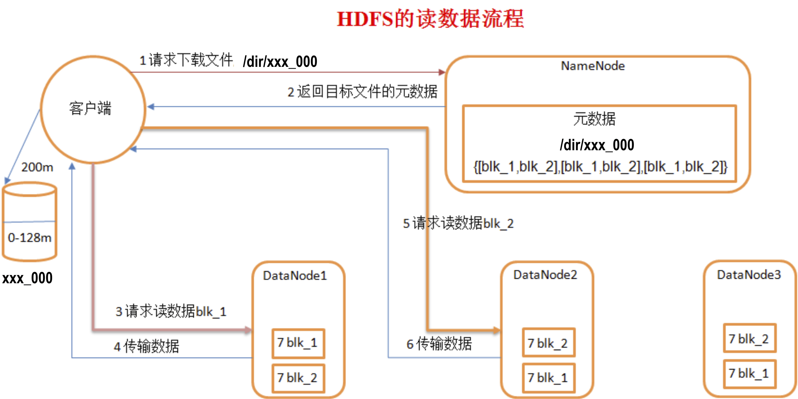
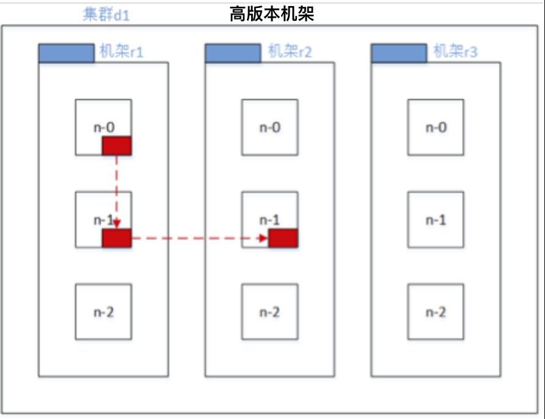
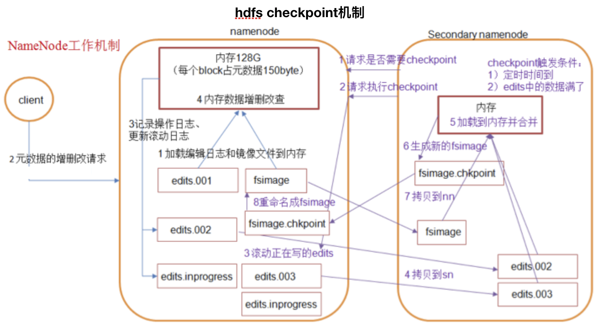
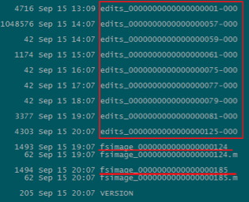
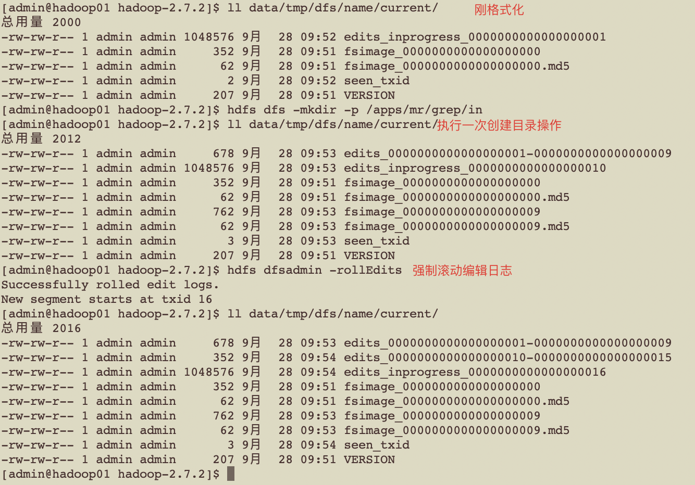
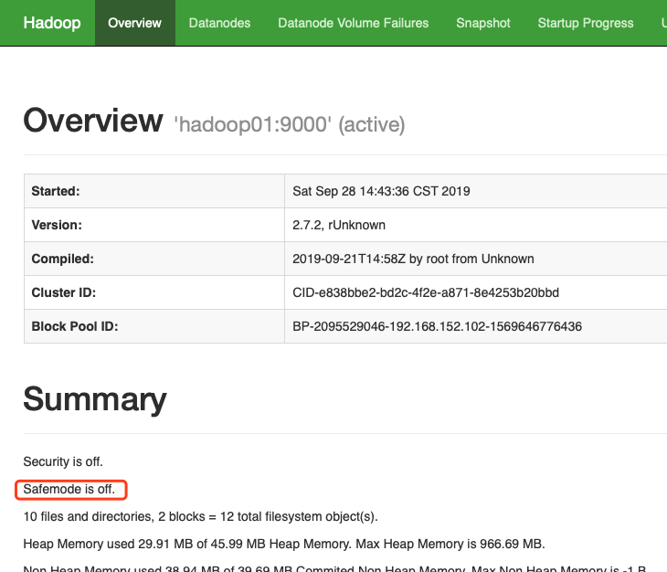

是什么？
```
 1）HDFS 是一个文件系统,用于存储文件,通过层级目录树定位文件;其次,是分布式存储的,由多台服务器联合使用,各自承担不同角色,完成系统集群功能.
 2）HDFS的设计适合一次写入,多次读出常见,有编辑文件的操作,但一般不推荐使用,因为hdfs是被定位为数据仓库,而非数据加工工厂.因此HDFS适合数据分析,不适合作网盘使用;
```

有什么？
```
Namenode: 
 1).负责管理整个文件系统的元数据,以及每一个路径(文件)对应的块信息;
 2).在hadoop-2.7.2/etc/hadoop/core-site.xml 中定义文件系统根 "fs.defaultFS"，存储目录"hadoop.tmp.dir"
 3).市面流行的服务器内存大小为128G,datanode存储的数据块block,在namenode上的注册元文件大小为150Byte左右,
 小文件推荐使用 hadoop har -HarName xzz.har -p /user/in /user/out 进行压缩,可以节省Nn空间;
 
Datenode
1).datanode负责存储数据块,每个数据块都可以在多个Dn节点上存储,保证整个文件系统有多个此数据块的副本;
2).集群初始启动,会进入安全模式safemode,大约持续30s时间,此过程Nn会加载fsimage 文件系统镜像,edit编辑日志到内存构建完整的文件系统存储信息,
以及上次停机时保存的Dn节点块的元数据信息(块长度,校验和,时间戳),随后启动的Dn节点会自动往Nn册实时块元数据信息,通过Nn比对,决定Dn节点哪些块完好,哪些块损坏不能继续使用;
3).Nn节点定期检测Dn节点心跳(默认30s),发现某个Dn节点失联时,不会立刻判断该节点失效,而是重连两次(时间间隔5min),因此判断Dn节点失联的时间间隔为2x5min + 30 s 10min30s ;
4).Dn 节点周期性对本节点的块进行校验checksum,发现某块的checksum发生更改,即判断此块失效,客户端发生编辑请求时,会被该Dn节点同步到其他可以的节点.
5).默认块副本数为 3，通过在hdfs-site.xml修改"dfs.replication"，指定副本数。
块默认长度 126

Block 块
1).上传任意大小的文件到 hdfs ,都会被拆解成为 若干数据块blocks,每个block的上限对于单节点本地文件系统为64M,分布式文件系统为128M,每个block块,在Nn上注册的元数据大小为150Byte;
2).Dn空间足够时,上传文件会在指定的Dn节点上全量备份,Dn空间不足够时,则会分拆到不同节点备份;
3).传输的每一个块,只有当内存次磁盘寻址时间占比为1%时,传输效率最高,市面默认服务器传输带宽为100M/s,磁盘寻址平均时间为10ms,
传输每个块需要的时间为10ms÷1%=1000ms=1s,此时间内传输数据量,就是块的大小 1s×100M/s =100M ,因此块大小在大于100Mb,且为2的幂次结果时,最佳选项就是128M.

SecondaryNamenode
1) SecondaryNamenode 用来监控HDFS状态的辅助后台程序,定期执行checkpoint帮助Namenode完成文件系统镜像备份fsimage;
2) 此外SecondaryNamenode 备份了与Namenode 相同的块元数据信息,当Nn意外宕机,可以通过拷贝Sn的data/tmp/dfs/secondaryname 恢复Nn的数据
3) 在hdfs-site.xml中指定"dfs.namenode.secondary.http-address"分配Sn节点，集群在未明确指明Sn节点时,默认会在Nn节点启动Sn
```

常用命令
``` 
查看帮助 hdfs dfs -help CMD 
$ hdfs dfs -help ls 
    -d 只查看目录
    -h 字节可读性
    -R 递归扫描

创建目录
$ hdfs dfs -mkdir
    -p 多层创建

本地剪切到hdfs(等效于 put)
$ hdfs dfs -moveFromLocal source ... to

hdfs剪切到本地（等效于 get）
$ hdfs dfs -moveToLocal source ... to

本地拷贝到hdfs(等效于 put)
$ hdfs dfs -copyFromLocal source ... to

hdfs拷贝到本地（等效于 get）
$ hdfs dfs -copyToLocal source ... to

本地文件追加到 hdfs 文件(文件不存在回创建)
$ hdfs dfs -appendToFile source ... to

查看文件（可同时查看多个）
$ hdfs dfs -cat file ...

查看 hdfs 文件( The allowed formats are zip and TextRecordInputStream and Avro.)
$ hdfs dfs -text file

查看最后 1 kb 内容(不支持通配)
$ hdfs dfs -tail file

修改属组
$ hdfs dfs -chgrp [-R] file

修改属主
$ hdfs dfs -chown [-R] xxx file

修改权限
$ hdfs dfs -chmod [-R] 755 file

hdfs拷贝到hdfs
$ hdfs dfs -cp source ... to

hdfs移动到hdfs
$ hdfs dfs -mv source ... to

文件系统可用空间
$ hdfs dfs -df

查看指定目录空间大小
$ hdfs dfs -du /dir 
    -s 统计汇总
    -h 字节格式化
    
统计文件个数
$ hdfs dfs -count /dir

设置文件副本数（节点退役时，如果副本数少于约定最小副本数，无法退役，需要调整副本数设置，才能完成退役）
$ hdfs dfs -setrep num file
```

[API 测试](https://github.com/GitHuHao/hadoop/blob/master/hdfs-practice/src/com/bigdata/hadoop/TestHDFS.java)
```
jar: hadoop-2.7.2-src 
    source 
    test 
    list
 
```

hdfs写数据
```
流程：
1.client 向 namenode 请求上传本地 xxx_000 文件到 hdfs /dir 目录;
2.namenode 查看 请求上传文件目录 /dir 是否存在，以及当前路径下是否有同名资源存在，然后做出反馈;
3.client 收到 namenode 允许上传反馈，向 namenode 请求上传 xxx_000 文件的第一个块文件 block;
4.namenode筛选出存储第一个数据块 block1 的副本的 datanode 节点列表[dn1,dn2,dn...]，将其反馈给 client;
5.client 请求与dn1建立数据传输通道，dn1 继续请求 dn2 建立数据通道，以此类推被请求的 dn 节点依次将上一个dn节点的请求事件放入响应队列，
当dn列表全部覆盖，逐级回应，至此第一个数据块block1 的传输通道建立完毕；
6.client 开始向 dn1 传输数据，dn1 成功接收数据后，将内存数据刷盘，然后继续将内存数据传输给 dn2,依次全部副本节点数据接收完毕，然后 逐级回馈，最后关闭数据传输通道；
7.第一个数据块 block1上传完毕，client 继续向 namenode请求上传第二数据块block2, namenode 继续筛选存储 block2的 datanode 列表，然后重复上述操作完成 block2 的持久化；
8.重复上述 2-7全部操作，完成 xxx_000 文件在满足规定最小副本数前提下的分布式存储。

要点：
1.数据量较大文件会被切分成若干块大小，存储某个块的 datanode 节点，不一定存储了文件的全部块，在满足最小副本数前提下可以，进行更多副本的冗余存储；
2.机器磁盘寻址时间约为10 ms，即找到目标 block 时间约为10 ms。寻址时间约为传输时间 1%时体验最佳，即块的传输时间应控制在 10ms/0.01 = 1000ms =1s。
目前磁盘传输速率约为 100M/s, 所以块大小应该在 100M/s * 1s = 100M 附近，且为 2^n 最为适宜，因此默认块大小 128M，实际存储时，最好略小于此阈值
```


hdfs读数据
```
 1) 客户端向 namenode 发生下载数据请求(/dir/xxx_000),Nn节点查询反馈回一串dn-list 列表[blk-1[dn1,dn2,dn..], blk-2[db1,dn2...], blk-n[dn...]...];
 2) 客户端开始下载第一个数据块blk-1[dn1,dn2...], 如果处于某个给定的dn节点上,优先从此dn节点下载(就近原则),否则随机下载;
 3) 客户端下载完第一个数据块blk-1,开始下载第二个blk2,并遵循2)相同的"就近优先,其次随机"的原则;
 4) 重复上述2)-3)操作,直至下载完所有数据,下载期间所有的blk数据库可以被同时 或 逐个下载,适dn节点与客户端环境而定,所有数据块在客户端内存完成数据合并,
 然后持久化存储到磁盘,就完成了从hdfs下载指定资源的流程.
```


[hdfs 数据一致性](https://github.com/GitHuHao/hadoop/blob/master/hdfs-practice/src/com/bigdata/hadoop/TestHDFS.java)
```
详见 checkConsistency 注释
```

机架感知
```
网络拓扑
    在本地网络中，两个节点被称为“彼此近邻”是什么意思？在海量数据处理中，其主要限制因素是节点之间数据的传输速率——带宽很稀缺。这里的想法是将两个节点间的带宽作为距离的衡量标准。
     
节点距离：
    两个节点到达最近的共同祖先的距离总和。 
    例如，假设有数据中心d1机架r1中的节点n1。该节点可以表示为/d1/r1/n1。利用这种标记，这里给出四种距离描述。 
    Distance(/d1/r1/n1, /d1/r1/n1)=0（同一节点上的进程） 
    Distance(/d1/r1/n1, /d1/r1/n2)=2（同一机架上的不同节点） 
    Distance(/d1/r1/n1, /d1/r3/n2)=4（同一数据中心不同机架上的节点） 
    Distance(/d1/r1/n1, /d2/r4/n2)=6（不同数据中心的节点） 
    
官网文档
    http://hadoop.apache.org/docs/r2.7.2/hadoop-project-dist/hadoop-common/RackAwareness.html

block存储datanode筛选原则
低版本hadoop
    当上传文件的 client 为 dn 节点之一时，block的第一个副本会优先选在 client 所在节点(否则随机)，第二个副本选在与此 client 不同机架的任意节点上，第三个副本选在与第二个副本相同机架不同的随机节点上；
    
hadoop2.7.2
    当上传文件的 client 为 dn 节点之一时，block的第一、二个副本会优先选在 client 所在节点(否则随机)，第三个副本选在与此 client 不同机架的任意节点上；

```

   

自定义机架感知
```
机器环境
    关闭旧集群
    $ cd /opt/softwares/hadoop-2.7.2
    $ sbin/stopAll.sh
    
    克隆 hadoop03节点 创建 hadoop04 hadoop05
    修改主机名
    # vim /etc/hostname
    
    添加 IP 主机名映射
    # vim /etc/hosts
    
    修改 IP
    # vim /etc/sysconfig/network-scripts/ifcfg-ens33
    
    重启机器
    # reboot
    
    修改 root的 ssh 秘钥
    # rm -rf /root/.ssh
    # ssh-keygen -t rsa
    
    修改 admin的 ssh 秘钥，并增加免密登录节点
    $ rm -rf ~/.ssh
    $ ssh-keygen -t rsa
    $ ssh-copy-id -i admin@hadoop0x
    
    修改辅助脚本，添加新节点
    $ sudo vim /usr/local/bin/xsync
    $ sudo vim /usr/local/bin/xcall
    
    扩充权限
    $ sudo chmod 755 -R /usr/local/bin
    
    同步更新
    $ xsync /usr/local/bin/{xsync,xcall}
    
集群规划
    192.168.152.102 hadoop01    rack1 namenode datanode nodemanager
    192.168.152.103 hadoop02    rack1 secondarynamenoe datanode nodemanager historyserver
    192.168.152.104 hadoop03    rack2 yarnmanager datanode nodemanager
    192.168.152.105 hadoop04    rack2 datanode nodemanager
    192.168.152.106 hadoop05    rack3 datanode nodemanager

添加 hadoop04.hadoop05 到 slaves
$ cd /opt/softwares/hadoop-2.7.2
$ vim etc/hadoop/slaves
$ xsync etc/hadoop/slaves

启动集群
$ ./sbin/startAll.sh
----------------------------------------------
>>> ssh admin@hadoop01 "cd /opt/softwares/hadoop-2.7.2; jps"
3764 NodeManager
3461 NameNode
4166 Jps

>>> ssh admin@hadoop02 "cd /opt/softwares/hadoop-2.7.2; jps"
3285 NodeManager
3207 SecondaryNameNode
3100 DataNode
3695 Jps

>>> ssh admin@hadoop03 "cd /opt/softwares/hadoop-2.7.2; jps"
3245 ResourceManager
3373 NodeManager
3886 Jps

>>> ssh admin@hadoop04 "cd /opt/softwares/hadoop-2.7.2; jps"
3762 Jps
3383 NodeManager
3276 DataNode

>>> ssh admin@hadoop05 "cd /opt/softwares/hadoop-2.7.2; jps"
3792 Jps
3449 NodeManager
3342 DataNode
----------------------------------------------

WEB页面查看（之前存储的文件，部分 block 已经自动负载到 hadoop04 hadoop05 节点存储）
http://hadoop01:50070/explorer.html#/apps/test

机架路由代码
hadoop/hdfs-practice/src/com/bigdata/hadoop/AutoTack.java

打包
    File(Project Structure) > 
    ProjectSettings(Artifacts) > 
    "➕"Jar(from modules) > 
    确认页从"Output layout"删除依赖，只保留"complie output" > 
    Build(build artifacts) 打包
    
上传 jar
$ cp hdfs-practice.jar  share/hadoop/common/

修改配置
$ vim /etc/hadoop/core-site.xml
----------------------------------------------
<property>
	<!-- 注册自定义的机架路由 core-default.xml中默认是 net.topology.node.switch.mapping.impl -->
	<name>net.topology.node.switch.mapping.impl</name>
	<value>com.bigdata.hadoop.AutoTack</value>
</property>
----------------------------------------------

分发(不能直接分发整个 /opt/softwares/hadoop-2.7.2 目录)
xsync  share/hadoop/common/hdfs-practice.jar /etc/hadoop/core-site.xml

刷新集群
    $ hdfs dfsadmin -refreshNodes
    $ yarn rmadmin -refreshNodes

查看集群
$ xcall jps

上传测试
$ hadoop fs -rm -r /apps/test/hadoop-2.7.2.tar.gz
$ hadoop fs -put ../../downloads/hadoop-2.7.2.tar.gz /apps/test

查看块存储信息

hadoop-2.7.2.tar.gz
    block0 [hadoop01 hadoop02 hadoop05]
    block1 [hadoop01 hadoop02 hadoop04]

符合预期
    client为 dn 节点时，文件所有块的第一、二副本存储在相同机架不同节点，其他副本随机
```

namenode & secondarynamenode checkpoint 工作机制
``` 
namenode 
1.集群初始化时，创建编辑日志 edits.inprocess 和 镜像文件 fsimage ,hdfs 工作时 完整文件，按默认块大小分割成若干 block，每个 block又遵循最小副本数原则，冗余存储到 dn节点。
dn节点存储块默认大小 128M，nn节点存储块元数据文件为 150byte；
2.某次集群重启完毕，namenode 会获取最近的镜像文件加载到内存，然后以其为基础执行最近编辑日志，完成元数据回放操作；
3.客户端请求对文件进行操作，引起元数据的变更时，nn先将变更记录到当前正在编辑的编辑日志 edits.inprocess，然后对内存完整元数据执行操作；
4.存储在当前正在编辑日志中的元数据操作，会定期由 sn 节点 通过 checkpoint 机制合并到最新的 fsimage 中，实现元数据结果备份。

secondary namenode
1.所有到达 nn节点元数据变更请求，先执行预写入日志记录到编辑日志 edits.inprocess，然后对内存中维护的全量元数据进行变更，nn节点自身不会将编辑日志变更合并到 镜像文件fsimage，
承担此项 元数据结果 checnpoint 操作的时 sn节点，集群中在未指定 sn节点部署机器是，回默认在 nn 相同节点选择一台承担 sn 角色，此会导致内存需求翻倍，因此实际部署时，通常将这避免将 nn,sn 部署在同一台机器；
2.sn 触发 checkpoint 操作默认机制时，定时 3600 秒执行，或 监控到 编辑日志edits.inprocess中最近连续操作超过百万次，就执行 checkpoint；
3.sn 定期询问 nn 是否需要执行 checkpoint 操作，当满足 上述触发条件时，nn 反馈同意执行 checkpoint，sn 会向 nn 申请执行 checkpoint, nn先滚动编辑日志 edits.inprocess(原来的带上操作编号重命名，然后创建新的同名文件),
然后通知 sn 可以执行 checkpoint;
4.sn 从 nn 拷贝上次 checkpoint 的 fsimage 文件，和刚滚动的 editis.xxx 到本地，然后基于编辑日志editis.xxx 回放变更操作，将元数据更新合并到 fsimage 生成新的 fsimage.checkpoint 文件，然后通知 nn checkpoint 结束，
可以拉取 fsimage.checkpoint了；
5.nn拷贝sn的fsimage.checkpoint 文件到本地，将先前 fsimage 文件重命名，带上操作编号，然后将拷贝过来的simage.checkpoint文件重命名为 fsimage ,至此一次 checkpoint 操作完毕。
```


相关参数
```
fsimage元数据镜像文件最多维持版本个数(保存最近的几次 checkpoint 文件，最新损坏后，可以重上一次 checkpoint 回放)
$ vim etc/hadoop/core-site.xml
----------------------------------------------
<property>
    <name>dfs.namenode.num.checkpoints.retained</name>
    <value>2</value>
</property>
----------------------------------------------

元数据编辑日志相关参数
edits.xxx 编辑日志最多版本数
$ vim etc/hadoop/core-site.xml
----------------------------------------------
<property>
    <name>dfs.namenode.num.extra.edits.retained</name>
    <value>1000000</value>
</property>
----------------------------------------------

checkpoint 相关参数
----------------------------------------------
<!--最长chkp间隔,单位:秒-->
<property>
 <name>dfs.namenode.checkpoint.period</name>
 <value>3600</value>
</property>

<!-- 最长间隔内，提前触发chkp的条数：编辑超过10^6次 -->
<property>
 <name>dfs.namenode.checkpoint.txns</name>
 <value>1000000</value>
</property>

<!-- 编辑次数轮询检测时间间隔（每60秒）检测一次提前触发条件是否满足-->
<property>
 <name>dfs.namenode.checkpoint.check.period</name>
 <value>60</value>
 <description>The SecondaryNameNode and CheckpointNode will poll the NameNode
 every 'dfs.namenode.checkpoint.check.period' seconds to query the number
 of uncheckpointed transactions.
 </description>
</property>

<!-- chkp 失败重试次数 -->
<property>
 <name>dfs.namenode.checkpoint.max-retries</name>
 <value>3</value>
</property>
----------------------------------------------
```


强制执行 checkpoint
``` 
$ hdfs dfsadmin -rollEdits
----------------------------------------------
Successfully rolled edit logs.
New segment starts at txid 24
----------------------------------------------
```


fsimage 导出
``` 
$ hdfs oiv -p XML -i data/tmp/dfs/name/current/fsimage_0000000000000000009 -o fsimage09.xml
$ cat fsimage09.xml 
----------------------------------------------
<?xml version="1.0"?>
<fsimage><NameSection>
<genstampV1>1000</genstampV1><genstampV2>1000</genstampV2><genstampV1Limit>0</genstampV1Limit><lastAllocatedBlockId>1073741824</lastAllocatedBlockId><txid>9</txid></NameSection>
<INodeSection><lastInodeId>16391</lastInodeId><inode><id>16385</id><type>DIRECTORY</type><name></name><mtime>1569635546330</mtime><permission>admin:supergroup:rwxr-xr-x</permission><nsquota>9223372036854775807</nsquota><dsquota>-1</dsquota></inode>
<inode><id>16386</id><type>DIRECTORY</type><name>tmp</name><mtime>1569635546339</mtime><permission>admin:supergroup:rwxrwx---</permission><nsquota>-1</nsquota><dsquota>-1</dsquota></inode>
<inode><id>16387</id><type>DIRECTORY</type><name>hadoop-yarn</name><mtime>1569635546339</mtime><permission>admin:supergroup:rwxrwx---</permission><nsquota>-1</nsquota><dsquota>-1</dsquota></inode>
<inode><id>16388</id><type>DIRECTORY</type><name>staging</name><mtime>1569635546339</mtime><permission>admin:supergroup:rwxrwx---</permission><nsquota>-1</nsquota><dsquota>-1</dsquota></inode>
<inode><id>16389</id><type>DIRECTORY</type><name>history</name><mtime>1569635546437</mtime><permission>admin:supergroup:rwxrwx---</permission><nsquota>-1</nsquota><dsquota>-1</dsquota></inode>
<inode><id>16390</id><type>DIRECTORY</type><name>done</name><mtime>1569635546340</mtime><permission>admin:supergroup:rwxrwx---</permission><nsquota>-1</nsquota><dsquota>-1</dsquota></inode>
<inode><id>16391</id><type>DIRECTORY</type><name>done_intermediate</name><mtime>1569635546437</mtime><permission>admin:supergroup:rwxrwxrwt</permission><nsquota>-1</nsquota><dsquota>-1</dsquota></inode>
</INodeSection>
<INodeReferenceSection></INodeReferenceSection><SnapshotSection><snapshotCounter>0</snapshotCounter></SnapshotSection>
<INodeDirectorySection><directory><parent>16385</parent><inode>16386</inode></directory>
<directory><parent>16386</parent><inode>16387</inode></directory>
<directory><parent>16387</parent><inode>16388</inode></directory>
<directory><parent>16388</parent><inode>16389</inode></directory>
<directory><parent>16389</parent><inode>16390</inode><inode>16391</inode></directory>
</INodeDirectorySection>
<FileUnderConstructionSection></FileUnderConstructionSection>
<SnapshotDiffSection><diff><inodeid>16385</inodeid></diff></SnapshotDiffSection>
<SecretManagerSection><currentId>0</currentId><tokenSequenceNumber>0</tokenSequenceNumber></SecretManagerSection><CacheManagerSection><nextDirectiveId>1</nextDirectiveId></CacheManagerSection>
</fsimage>
----------------------------------------------
```

editis 编辑日志导出
``` 
$ hdfs oev -p XML -i data/tmp/dfs/name/current/edits_0000000000000000001-0000000000000000009 -o edits1-9.xml
$ cat edits1-9.xml 
----------------------------------------------
<?xml version="1.0" encoding="UTF-8"?>
<EDITS>
  <EDITS_VERSION>-63</EDITS_VERSION>
  <RECORD>
    <OPCODE>OP_START_LOG_SEGMENT</OPCODE>
    <DATA>
      <TXID>1</TXID>
    </DATA>
  </RECORD>
  <RECORD>
    <OPCODE>OP_MKDIR</OPCODE>
    <DATA>
      <TXID>2</TXID>
      <LENGTH>0</LENGTH>
      <INODEID>16386</INODEID>
      <PATH>/tmp</PATH>
      <TIMESTAMP>1569635546330</TIMESTAMP>
      <PERMISSION_STATUS>
        <USERNAME>admin</USERNAME>
        <GROUPNAME>supergroup</GROUPNAME>
        <MODE>504</MODE>
      </PERMISSION_STATUS>
    </DATA>
  </RECORD>
  <RECORD>
    <OPCODE>OP_MKDIR</OPCODE>
    <DATA>
      <TXID>3</TXID>
      <LENGTH>0</LENGTH>
      <INODEID>16387</INODEID>
      <PATH>/tmp/hadoop-yarn</PATH>
      <TIMESTAMP>1569635546339</TIMESTAMP>
      <PERMISSION_STATUS>
        <USERNAME>admin</USERNAME>
        <GROUPNAME>supergroup</GROUPNAME>
        <MODE>504</MODE>
      </PERMISSION_STATUS>
    </DATA>
  </RECORD>
  <RECORD>
    <OPCODE>OP_MKDIR</OPCODE>
    <DATA>
      <TXID>4</TXID>
      <LENGTH>0</LENGTH>
      <INODEID>16388</INODEID>
      <PATH>/tmp/hadoop-yarn/staging</PATH>
      <TIMESTAMP>1569635546339</TIMESTAMP>
      <PERMISSION_STATUS>
        <USERNAME>admin</USERNAME>
        <GROUPNAME>supergroup</GROUPNAME>
        <MODE>504</MODE>
      </PERMISSION_STATUS>
    </DATA>
  </RECORD>
  <RECORD>
    <OPCODE>OP_MKDIR</OPCODE>
    <DATA>
      <TXID>5</TXID>
      <LENGTH>0</LENGTH>
      <INODEID>16389</INODEID>
      <PATH>/tmp/hadoop-yarn/staging/history</PATH>
      <TIMESTAMP>1569635546339</TIMESTAMP>
      <PERMISSION_STATUS>
        <USERNAME>admin</USERNAME>
        <GROUPNAME>supergroup</GROUPNAME>
        <MODE>504</MODE>
      </PERMISSION_STATUS>
    </DATA>
  </RECORD>
  <RECORD>
    <OPCODE>OP_MKDIR</OPCODE>
    <DATA>
      <TXID>6</TXID>
      <LENGTH>0</LENGTH>
      <INODEID>16390</INODEID>
      <PATH>/tmp/hadoop-yarn/staging/history/done</PATH>
      <TIMESTAMP>1569635546340</TIMESTAMP>
      <PERMISSION_STATUS>
        <USERNAME>admin</USERNAME>
        <GROUPNAME>supergroup</GROUPNAME>
        <MODE>504</MODE>
      </PERMISSION_STATUS>
    </DATA>
  </RECORD>
  <RECORD>
    <OPCODE>OP_MKDIR</OPCODE>
    <DATA>
      <TXID>7</TXID>
      <LENGTH>0</LENGTH>
      <INODEID>16391</INODEID>
      <PATH>/tmp/hadoop-yarn/staging/history/done_intermediate</PATH>
      <TIMESTAMP>1569635546437</TIMESTAMP>
      <PERMISSION_STATUS>
        <USERNAME>admin</USERNAME>
        <GROUPNAME>supergroup</GROUPNAME>
        <MODE>493</MODE>
      </PERMISSION_STATUS>
    </DATA>
  </RECORD>
  <RECORD>
    <OPCODE>OP_SET_PERMISSIONS</OPCODE>
    <DATA>
      <TXID>8</TXID>
      <SRC>/tmp/hadoop-yarn/staging/history/done_intermediate</SRC>
      <MODE>1023</MODE>
    </DATA>
  </RECORD>
  <RECORD>
    <OPCODE>OP_END_LOG_SEGMENT</OPCODE>
    <DATA>
      <TXID>9</TXID>
    </DATA>
  </RECORD>
</EDITS>
----------------------------------------------
```

nn元数据丢失从sn恢复
``` 
方案 1：直接拷贝 sn namesecondary 目录 到 nn 作为 name目录
$ pwd
----------------------------------------------
/opt/softwares/hadoop-2.7.2
----------------------------------------------

$ xcall jps 
----------------------------------------------
>>> ssh admin@hadoop01 "cd /opt/softwares/hadoop-2.7.2; jps"
17841 NameNode
18085 Jps
16749 DataNode
16990 NodeManager

>>> ssh admin@hadoop02 "cd /opt/softwares/hadoop-2.7.2; jps"
11298 DataNode
11495 NodeManager
11577 JobHistoryServer
12027 Jps
11404 SecondaryNameNode

>>> ssh admin@hadoop03 "cd /opt/softwares/hadoop-2.7.2; jps"
12506 ResourceManager
12622 NodeManager
12367 DataNode
13135 Jps
----------------------------------------------

$ hdfs dfs -put ../../downloads/hadoop-2.7.2.tar.gz /apps/test

$ kill 17841
rm -rf data/tmp/dfs/name

$ scp -r admin@hadoop02:/opt/softwares/hadoop-2.7.2/data/tmp/dfs/namesecondary data/tmp/dfs/
----------------------------------------------
in_use.lock                                                                                                                                                                                                 100%   14     0.0KB/s   00:00    
fsimage_0000000000000000000.md5                                                                                                                                                                             100%   62     0.1KB/s   00:00    
fsimage_0000000000000000000                                                                                                                                                                                 100%  352     0.3KB/s   00:00    
edits_0000000000000000001-0000000000000000020                                                                                                                                                               100% 1586     1.6KB/s   00:00    
fsimage_0000000000000000020.md5                                                                                                                                                                             100%   62     0.1KB/s   00:00    
fsimage_0000000000000000020                                                                                                                                                                                 100%  985     1.0KB/s   00:00    
VERSION
----------------------------------------------  

$ ./sbin/hadoop-daemon.sh start namenode
----------------------------------------------  
starting namenode, logging to /opt/softwares/hadoop-2.7.2/logs/hadoop-admin-namenode-hadoop01.out
----------------------------------------------  

$ hdfs dfs -ls /apps/test
----------------------------------------------  
Found 1 items
-rw-r--r--   3 admin supergroup  212046774 2019-09-28 13:00 /apps/test/hadoop-2.7.2.tar.gz
----------------------------------------------  

方案 2：拷贝 sn 目录使用命令导入
$ jps
---------------------------------------------- 
17841 NameNode
18456 Jps
16749 DataNode
16990 NodeManager
---------------------------------------------- 

$ kill 17841

$ rm -rf data/tmp/dfs/name

$ scp -r admin@hadoop02:/opt/softwares/hadoop-2.7.2/data/tmp/dfs/namesecondary data/tmp/dfs/
---------------------------------------------- 
in_use.lock                                                                                                                                                                                                 100%   14     0.0KB/s   00:00    
fsimage_0000000000000000000.md5                                                                                                                                                                             100%   62     0.1KB/s   00:00    
fsimage_0000000000000000000                                                                                                                                                                                 100%  352     0.3KB/s   00:00    
edits_0000000000000000001-0000000000000000020                                                                                                                                                               100% 1586     1.6KB/s   00:00    
fsimage_0000000000000000020.md5                                                                                                                                                                             100%   62     0.1KB/s   00:00    
fsimage_0000000000000000020                                                                                                                                                                                 100%  985     1.0KB/s   00:00    
VERSION    
---------------------------------------------- 

$ ls -l data/tmp/dfs/
---------------------------------------------- 
data/tmp/dfs/:
总用量 0
drwx------ 3 admin admin 40 9月  28 12:59 data
drwxrwxr-x 3 admin admin 40 9月  28 13:48 name
drwxrwxr-x 3 admin admin 40 9月  28 13:48 namesecondary
[admin@hadoop01 hadoop-2.7.2]$ 
---------------------------------------------- 

$ ls -l data/tmp/dfs/namesecondary/
---------------------------------------------- 
总用量 4
drwxrwxr-x 2 admin admin 222 9月  28 13:48 current
-rw-rw-r-- 1 admin admin  14 9月  28 13:48 in_use.lock
---------------------------------------------- 

删除锁
$ rm -rf data/tmp/dfs/namesecondary/in_use.lock

修改 checkpoint 间隔，声明 importCheckpoint 操作导入到的目录(注，无需分发)
$ vim etc/hadoop/hdfs-site.xml  
---------------------------------------------- 
<!-- 调整chkp最长时间周期为2min -->
<property>
    <name>dfs.namenode.checkpoint.period</name>
    <value>120</value>
</property>
<!-- 指明执行hdfs namenode -importCheckpoint 将Sn数据导入的路径 -->
<property>
    <name>dfs.namenode.name.dir</name>
    <value>/opt/softwares/hadoop-2.7.2/data/tmp/dfs/name</value>
</property>
---------------------------------------------- 

$ hdfs namenode -importCheckpoint (导入元数据过程时间非常长，但其间 hdfs 仍然是可以访问的)
---------------------------------------------- 
.......
19/09/28 13:48:34 INFO common.Storage: Lock on /opt/softwares/hadoop-2.7.2/data/tmp/dfs/name/in_use.lock acquired by nodename 18726@hadoop01  上锁
19/09/28 13:48:34 INFO namenode.FSImage: Storage directory /opt/softwares/hadoop-2.7.2/data/tmp/dfs/name is not formatted. 
19/09/28 13:48:34 INFO namenode.FSImage: Formatting ...  重新格式化
19/09/28 13:48:34 INFO common.Storage: Lock on /opt/softwares/hadoop-2.7.2/data/tmp/dfs/namesecondary/in_use.lock acquired by nodename 18726@hadoop01
19/09/28 13:48:34 WARN namenode.FSNamesystem: !!! WARNING !!!
......
19/09/28 13:49:05 INFO hdfs.StateChange: STATE* Safe mode is OFF 退出安全模式
19/09/28 13:49:05 INFO hdfs.StateChange: STATE* Network topology has 3 racks and 3 datanodes 
19/09/28 13:49:05 INFO hdfs.StateChange: STATE* UnderReplicatedBlocks has 0 blocks 
......
19/09/28 14:01:10 INFO namenode.TransferFsImage: Downloaded file fsimage.ckpt_0000000000000000022 size 985 bytes.
19/09/28 14:01:10 INFO namenode.NNStorageRetentionManager: Going to retain 2 images with txid >= 20
19/09/28 14:16:03 INFO BlockStateChange: BLOCK* processReport: from storage DS-b610d59a-b1e1-4f8b-9b22-c10403384e39 node DatanodeRegistration(192.168.152.104:50010, datanodeUuid=fde108a2-406f-4a75-a311-319376031f23, infoPort=50075, infoSecurePort=0, ipcPort=50020, storageInfo=lv=-56;cid=CID-e838bbe2-bd2c-4f2e-a871-8e4253b20bbd;nsid=417039089;c=0), blocks: 2, hasStaleStorage: false, processing time: 3 msecs

.....
^C 按 Ctrl + C 退出
19/09/28 14:39:47 ERROR namenode.NameNode: RECEIVED SIGNAL 2: SIGINT 
19/09/28 14:39:47 INFO namenode.NameNode: SHUTDOWN_MSG: 
/************************************************************
SHUTDOWN_MSG: Shutting down NameNode at hadoop01/192.168.152.102
************************************************************/
---------------------------------------------- 

$ ll data/tmp/dfs/name/current/
---------------------------------------------- 
总用量 1052
-rw-rw-r-- 1 admin admin      42 9月  28 14:01 edits_0000000000000000021-0000000000000000022
-rw-rw-r-- 1 admin admin 1048576 9月  28 14:01 edits_inprogress_0000000000000000023
-rw-rw-r-- 1 admin admin     985 9月  28 13:48 fsimage_0000000000000000020
-rw-rw-r-- 1 admin admin      62 9月  28 13:48 fsimage_0000000000000000020.md5
-rw-rw-r-- 1 admin admin     985 9月  28 14:01 fsimage_0000000000000000022
-rw-rw-r-- 1 admin admin      62 9月  28 14:01 fsimage_0000000000000000022.md5
-rw-rw-r-- 1 admin admin       3 9月  28 14:01 seen_txid
-rw-rw-r-- 1 admin admin     207 9月  28 13:48 VERSION
---------------------------------------------- 

$ vim etc/hadoop/hdfs-site.xml  （删除上面的注释）

重启 namenode
$ ./sbin/hadoop-daemon.sh start namenode


$ hadoop fs -ls /apps/test
---------------------------------------------- 
Found 1 items
-rw-r--r--   3 admin supergroup  212046774 2019-09-28 13:00 /apps/test/hadoop-2.7.2.tar.gz
---------------------------------------------- 
```

安全模式
``` 
含义：集群只允许读，不允许写操作的模式。
1.hdfs 集群刚启动，加载 镜像文件和编辑日志到 到 namenode 内存过程，只允许对元数据的读操作，不允许变更的过程，为安全模式，刚执行 格式化的集群，由于尚未存储任何文件，因此启动时跳过安全模式，直接开机；
2.hdfs 启动过程，dn 节点会统计存储文件块的信息(名称，权限，校验和)等然后汇报给 nn, nn通过比对各 dn节点上传文件块信息，判断文件块健康状态，当所有文件块最小副本数满足率达到 99.9% 以上时，就退出安全模式，一般持续 30s左右。
(默认块文件最小副本数 3，最大副本数 512)

相关命令
查看当前安全模式状态
$ hdfs dfsadmin -safemode get 

手动进入安全模式
$ hdfs dfsadmin -safemode enter

手动退出安全模式
$ hdfs dfsadmin -safemode leave 

判断集群是否处于安全模式，如果是则阻塞在此，直至退出安全模式再继续向下，否则直接向下执行 （避免直接向下执行 出异常）
$ hdfs dfsadmin -safemode wait

演示：
查看集群安全模式状态
$ hdfs dfsadmin -safemode get
---------------------------------------------- 
Safe mode is OFF
----------------------------------------------

hadoop01节点手动进入安全模式
$ hdfs dfsadmin -safemode enter
----------------------------------------------
Safe mode is ON
----------------------------------------------

hadoop02节点通过脚本在 hdfs 上创建目录，创建前检查是否处于安全模式
$ vim wait.sh
----------------------------------------------
#!/bin/bash

hdfs dfsadmin -safemode get
hdfs dfsadmin -safemode wait
hdfs dfs -mkdir -p /apps/mr/grep/in
----------------------------------------------

$ chmod 755 wait.sh

$ bash wait.sh
----------------------------------------------
Safe mode is ON
阻塞在此
----------------------------------------------

hadoop01 手动退出
$ hdfs dfsadmin -safemode leave
----------------------------------------------
Safe mode is OFF
----------------------------------------------

hadoop02 监控到安全模式退出，继续向下执行
----------------------------------------------
Safe mode is ON
Safe mode is OFF
----------------------------------------------

$ hdfs dfsadmin ls /apps/mr
----------------------------------------------
Found 1 items
drwxr-xr-x   - admin supergroup          0 2019-09-28 15:07 /apps/mr/grep
----------------------------------------------
```


namenode 多目录元数据备份
``` 
多目录配置（注 ${hadoop.tmp.dir} 引用的时 core-site.xml "hadoop.tmp.dir" 存储数据目录配置）
$ vim etc/hadoop/hdfs-site.xml  
----------------------------------------------
<!--hdfs namenode 多目录配置-->
<property>
    <name>dfs.namenode.name.dir</name>
    <value>file://${hadoop.tmp.dir}/dfs/name1,file://${hadoop.tmp.dir}/dfs/name2</value>
</property>
----------------------------------------------

分发配置
$ xsync etc/hadoop/hdfs-site.xml  

$ xcall rm -rf data/tmp/* logs/*
$ hdfs namenode -format
----------------------------------------------
......
19/09/28 15:24:26 INFO common.Storage: Storage directory /opt/softwares/hadoop-2.7.2/data/tmp/dfs/name1 has been successfully formatted.
19/09/28 15:24:26 INFO common.Storage: Storage directory /opt/softwares/hadoop-2.7.2/data/tmp/dfs/name2 has been successfully formatted.
......
----------------------------------------------

启动集群
$ startAll.sh

name1, name2 完全一致
$ ls -l data/tmp/dfs/name1/current/
----------------------------------------------
总用量 1052
-rw-rw-r-- 1 admin admin     678 9月  28 15:25 edits_0000000000000000001-0000000000000000009
-rw-rw-r-- 1 admin admin 1048576 9月  28 15:26 edits_inprogress_0000000000000000010
-rw-rw-r-- 1 admin admin     352 9月  28 15:24 fsimage_0000000000000000000
-rw-rw-r-- 1 admin admin      62 9月  28 15:24 fsimage_0000000000000000000.md5
-rw-rw-r-- 1 admin admin     762 9月  28 15:25 fsimage_0000000000000000009
-rw-rw-r-- 1 admin admin      62 9月  28 15:25 fsimage_0000000000000000009.md5
-rw-rw-r-- 1 admin admin       3 9月  28 15:25 seen_txid
-rw-rw-r-- 1 admin admin     208 9月  28 15:24 VERSION
----------------------------------------------

$ ls -l data/tmp/dfs/name2/current/
----------------------------------------------
总用量 1052
-rw-rw-r-- 1 admin admin     678 9月  28 15:25 edits_0000000000000000001-0000000000000000009
-rw-rw-r-- 1 admin admin 1048576 9月  28 15:26 edits_inprogress_0000000000000000010
-rw-rw-r-- 1 admin admin     352 9月  28 15:24 fsimage_0000000000000000000
-rw-rw-r-- 1 admin admin      62 9月  28 15:24 fsimage_0000000000000000000.md5
-rw-rw-r-- 1 admin admin     762 9月  28 15:25 fsimage_0000000000000000009
-rw-rw-r-- 1 admin admin      62 9月  28 15:25 fsimage_0000000000000000009.md5
-rw-rw-r-- 1 admin admin       3 9月  28 15:25 seen_txid
-rw-rw-r-- 1 admin admin     208 9月  28 15:24 VERSION
----------------------------------------------

$ hdfs dfs -mkdir -p /apps/test

删除其中之一
$ rm -rf data/tmp/dfs/name1

集群仍正常运行
$ xcall jps
----------------------------------------------
>>> ssh admin@hadoop01 "cd /opt/softwares/hadoop-2.7.2; jps"
22128 NameNode
22264 DataNode
22748 Jps
22511 NodeManager

>>> ssh admin@hadoop02 "cd /opt/softwares/hadoop-2.7.2; jps"
15665 Jps
15413 JobHistoryServer
15256 SecondaryNameNode
15337 NodeManager
15148 DataNode

>>> ssh admin@hadoop03 "cd /opt/softwares/hadoop-2.7.2; jps"
15920 ResourceManager
15781 DataNode
16037 NodeManager
16425 Jps
----------------------------------------------

仍然可读
$ hdfs dfs -ls /
----------------------------------------------
Found 2 items
drwxr-xr-x   - admin supergroup          0 2019-09-28 15:26 /apps
drwxrwx---   - admin supergroup          0 2019-09-28 15:25 /tmp
----------------------------------------------

任然可写
$ hdfs dfs -ls /apps/test
----------------------------------------------
Found 1 items
-rw-r--r--   3 admin supergroup  212046774 2019-09-28 15:35 /apps/test/hadoop-2.7.2.tar.gz
----------------------------------------------

说明 name1 name2 是相互备份关系

```

datanode 工作机制
``` 
namenode datanode 之间交互
1.namenode 初始化过程，创建了编辑日志和镜像文件，启动过程现先加载镜像文件，然后执行编辑日志回放文件块元数据，此过程客户端可读，不可写，称为安全模式阶段，运行其间，所有元数据变更操作，先记录编辑日志，然后执行操作，
secondarynamenoe 定期拷贝 namenode 上最小编辑日志合并到本地镜像文件，然后推送给 namenode,完成元数据定期checkpoint 备份；
2.hdfs 启动阶段 namenode 回放元数据同时，datanode 统计本节点上处处文件块的元数据(名称，时间戳，校验和)，并与本地存储的块元数据比对，然后向 nanemode 注册，并汇报块信息，健康状态，此后定期以1h 间隔向 namenode 上报块信息，
namenode 定期(3s)向 datanode 发生指令，感知 datanode 心跳，某次无法感知 dn 心跳时，不会马上将 dn 判定为失效，而是以 5min 间隔连续监测两次 以及期间 10 次心跳监测 5*2min + 10*3s = 10m30s ，然后才判定失效；
3.dn节点发现文件块校验和与之前记录不一致时，会判定此文件块失效，然后汇报 nn，接收 nn指令从其余 dn节点重新拉去此文件块，恢复文件副本数。
4.hdfs 提供了 dn节点动态伸缩，水平扩展能力，从而保证文件系统实时高可用。

datanode 掉线，namenode 监测时间间隔
vim etc/hadoop/core-site.xml
----------------------------------------------
<!--获取心跳失败,重新检测机制 默认 5 分钟-->
<property>
    <name>dfs.namenode.heartbeat.recheck-interval</name>
    <value>300000</value>
</property>

<!-- 正常心跳检测频率 默认 3 秒 -->
<property>
    <name>dfs.heartbeat.interval</name>
    <value>3</value>
</property>
----------------------------------------------
```

datanode 数据完整性保证
``` 
1.datanode 读取文件块前先实时计算 checksum
2.一旦实时计算值与 datanode 上块元数据文件 xxx.meta 中记录的不一致时，表明此文件块已经损坏，此时 datanode 向 namenode 汇报，由 namenode 指示从其余 datanode 节点重新拉去此文件块进行替换；
3.客户端读取文件块失败，会自动路由到其余datanode节点重新获取；
4.datanode 节点回定期检测当前节点文件块 checksum信息

手动 checksum
$ hdfs dfs -checksum /apps/test//hadoop-2.7.2.tar.gz
----------------------------------------------
/apps/test/hadoop-2.7.2.tar.gz	MD5-of-262144MD5-of-512CRC32C	00000200000000000004000019d107f81c0ac21af4f09ef1f6783368
----------------------------------------------
```

datanode 服役新节点
``` 
集群规划
    192.168.152.102 hadoop01 namenode datanode nodemanager  旧节点
    192.168.152.103 hadoop02 secondarynamenoe datanode nodemanager historyserver 旧节点
    192.168.152.104 hadoop03 yarnmanager datanode nodemanager 旧节点
    192.168.152.105 hadoop04 datanode nodemanager  新加入节点
    192.168.152.106 hadoop05 datanode nodemanager  新加入节点

datanode 新节点环境准备
    克隆hadoop01
    修改 hosts
    修改 hostname
    修改网络
    配置 ssh 通信

namenode节点创建记录 datanode 列表清单 （无需分发）
vim etc/hadoop/dfs.hosts
----------------------------------------------
hadoop01
hadoop02
hadoop03
hadoop04
hadoop05
----------------------------------------------

namenode节点修改 hdfs-site.xml 映入 dfs.hosts 文件 （无需分发）
----------------------------------------------
<!--增减 datanode时，在此文件列举 dn-->
<property>
    <name>dfs.hosts</name>
    <value>/opt/softwares/hadoop-2.7.2/etc/hadoop/dfs.hosts</value>
</property>
----------------------------------------------

namenode 节点刷新集群
$ hdfs dfsadmin -refreshNodes

$ yarn rmadmin -refreshNodes

$ hdfs dfsadmin -report （集群已经感知到 hadoop04 hadoop05 节点，但节点尚未启动)
----------------------------------------------
....

Live datanodes (3):  存活的

Name: 192.168.152.103:50010 (hadoop02)
Hostname: hadoop02
.......


Name: 192.168.152.104:50010 (hadoop03)
Hostname: hadoop03
.......


Name: 192.168.152.102:50010 (hadoop01)
Hostname: hadoop01
.......


Dead datanodes (2): 死亡的

Name: 192.168.152.105:50010 (hadoop04)
Hostname: hadoop04
.......

Name: 192.168.152.106:50010 (hadoop05)
Hostname: hadoop05
.......
----------------------------------------------

拷贝 hadoop03 节点到 hadoop04 hadoop05
$ scp -r /opt/softwares/hadoop-2.7.2 admin@hadoop04:/opt/softwares/
$ scp -r /opt/softwares/hadoop-2.7.2 admin@hadoop05:/opt/softwares/

hadoop04 hadoop05 删除元数据目录，和审计日志目录
$ cd /opt/softwares/hadoop-2.7.2
$ rm -rf  data/tmp/* logs/*

hadoop04 hadoop05 上启动各自的 datanode nodemanager
$ ./sbin/hadoop-daemon.sh start datanode
$ ./sbin/yarn-daemon.sh start nodemanager

$ jps
----------------------------------------------
7442 NodeManager
7333 DataNode
7736 Jps
----------------------------------------------

$ hdfs dfsadmin -report （集群已经成功接收 hadoop04 hadoop05)
----------------------------------------------
......

Live datanodes (5):

Name: 192.168.152.103:50010 (hadoop02)
Hostname: hadoop02
......


Name: 192.168.152.106:50010 (hadoop05)
Hostname: hadoop05
......


Name: 192.168.152.105:50010 (hadoop04)
Hostname: hadoop04
......


Name: 192.168.152.104:50010 (hadoop03)
Hostname: hadoop03
......


Name: 192.168.152.102:50010 (hadoop01)
Hostname: hadoop01
......
----------------------------------------------

固定集群
$ vim etc/hadoop/slaves  (添加 hadoop04 hadoop05)
----------------------------------------------
hadoop01
hadoop02
hadoop03
hadoop04
hadoop05
----------------------------------------------

分发
$ xsync etc/hadoop/slaves

移除 hdfs-site.xml 中 dfs.hosts 配置
$ vim etc/hadoop/hdfs-site.xml
$ rm -rf etc/hadoop/dfs.hosts

刷新集群
$ hdfs dfsadmin -refreshNodes
$ yarn rmadmin -refreshNodes

重启校验 能否顺利启动扩展后集群
```

退役节点
``` 
注：演示过程中，顺便测试块文件最小副本数约束。

集群规划
    192.168.152.102 hadoop01 namenode datanode nodemanager  旧节点
    192.168.152.103 hadoop02 secondarynamenoe datanode nodemanager historyserver 旧节点
    192.168.152.104 hadoop03 yarnmanager datanode nodemanager 旧节点
    192.168.152.105 hadoop04 datanode nodemanager  将退役节点
    192.168.152.106 hadoop05 datanode nodemanager  将退役节点

$ xcall jps
----------------------------------------------
>>> ssh admin@hadoop01 "cd /opt/softwares/hadoop-2.7.2; jps"
30298 NodeManager
30844 Jps
30045 DataNode
29902 NameNode

>>> ssh admin@hadoop02 "cd /opt/softwares/hadoop-2.7.2; jps"
20179 SecondaryNameNode
20260 NodeManager
20071 DataNode
20680 Jps
20335 JobHistoryServer

>>> ssh admin@hadoop03 "cd /opt/softwares/hadoop-2.7.2; jps"
21792 Jps
21217 ResourceManager
21086 DataNode
21342 NodeManager

>>> ssh admin@hadoop04 "cd /opt/softwares/hadoop-2.7.2; jps"
8470 DataNode
8891 Jps
8589 NodeManager

>>> ssh admin@hadoop05 "cd /opt/softwares/hadoop-2.7.2; jps"
8854 Jps
8572 NodeManager
8462 DataNode
----------------------------------------------

修改集群最小副本数 （从默认的 3 修改为 4）
$ vim etc/hadoop/hdfs-site.xml
----------------------------------------------
  <!--  文件系统存储数据块的副本数,从此处体现出为伪布式特点 --> 
  <property>
         <name>dfs.replication</name>
         <value>4</value>
  </property>
----------------------------------------------

分发
$ xsync etc/hadoop/hdfs-site.xml

刷新集群
$ hdfs dfsadmin -refreshNodes
$ yarn rmadmin -refreshNodes

编写即将退役节点清单
$ vim etc/hadoop/dfs.hadoop.exclude
----------------------------------------------
hadoop04
hadoop05
----------------------------------------------

将退役清单引入 hdfs-site.xml 配置 （只需在 namenode 节点配置，无需分发）
$ vim etc/hadoop/hdfs-site.xml
----------------------------------------------
<!-- 即将退役节点清单-->
<property>
 <name>dfs.hosts.exclude</name>
 <value>/opt/softwares/hadoop-2.7.2/etc/hadoop/dfs.hosts.exclude</value>
</property>
----------------------------------------------

刷新集群（尽管集群刷新成功，但 hdfs web页面显示 hadoop04 hadoop05 节点始终处于 process in Decommissing 状态）
$ hdfs dfsadmin -refreshNodes
$ yarn rmadmin -refreshNodes

手动修改副本数 （hdfs web页面显示 hadoop04 hadoop05 节点退役成功）
$ hdfs dfs -setrep 3 /apps/test/*

hadoop04 hadoop05 节点停止服务
$ ./sbin/yarn-daemon.sh stop nodemanager
$ ./sbin/hadoop-daemon.sh stop datanode

$ vim etc/hadoop/hdfs-site.xml (注释 dfs.hosts.exclude 释放 dfs.hosts, 并将 dfs.hosts 文件删除 hadoop04 hadoop04 无需分发)
----------------------------------------------
<!--增减 datanode时，在此文件列举 dn-->
<property>
    <name>dfs.hosts</name>
    <value>/opt/softwares/hadoop-2.7.2/etc/hadoop/dfs.hosts</value>
</property>

<!-- 即将退役节点清单-->
<!--
<property>
 <name>dfs.hosts.exclude</name>
 <value>/opt/softwares/hadoop-2.7.2/etc/hadoop/dfs.hosts.exclude</value>
</property>
-->
----------------------------------------------

$  vim etc/hadoop/slaves  (删除 hdoop04 hadoop05)
----------------------------------------------
hadoop01
hadoop02
hadop03
----------------------------------------------
$ xsync etc/hadoop/slaves （分发）

再次刷新集群（此时 hdfs web 页面 hadoop04 hadpoop05 节点彻底消失）
$ hdfs dfsadmin -refreshNodes
$ yarn rmadmin -refreshNodes
```

datanode 多目录配置
``` 
注：与 namenode 多目录配置相互备份不同，datanode 多目录配置不回进行相互备份，只不过将数据块存储在不同节点，各目录存储内容不同，后期配置 HA 时，可能属于不同 namenode 管理
$ vim 

<!-- datanode 存储文件多目录配置-->
<property>
    <name>dfs.datanode.data.dir</name>
    <value>file://${hadoop.tmp.dir}/dfs/data1,file://${hadoop.tmp.dir}/dfs/data2</value>
</property>

分发
$ xsync etc/hadoop/hdfs-site.xml

停止旧集群
$ stopAll.sh

删除旧集群文件
$ xcall rm -rf data/tmp* logs/*

格式化
$ hdfs namenode -format 

$ ls -l data/tmp/dfs
----------------------------------------------
总用量 0
drwx------ 3 admin admin 40 9月  28 23:10 data1
drwx------ 3 admin admin 40 9月  28 23:10 data2
drwxrwxr-x 3 admin admin 40 9月  28 23:10 name1
drwxrwxr-x 3 admin admin 40 9月  28 23:10 name2
----------------------------------------------

$ hdfs dfs -mkdir -p /apps/test
$ hdfs dfs -put ../../downloads/hadoop-2.7.2.tar.gz /apps/test

$ ll data/tmp/dfs/data1/current/BP-1696619814-192.168.152.102-1569683359405/current/finalized/subdir0/subdir0/
----------------------------------------------
总用量 132100
-rw-rw-r-- 1 admin admin 134217728 9月  28 23:11 blk_1073741825
-rw-rw-r-- 1 admin admin   1048583 9月  28 23:11 blk_1073741825_1001.meta
----------------------------------------------

$ ll data/tmp/dfs/data2/current/BP-1696619814-192.168.152.102-1569683359405/current/finalized/subdir0/subdir0/
----------------------------------------------
总用量 76604
-rw-rw-r-- 1 admin admin 77829046 9月  28 23:11 blk_1073741826
-rw-rw-r-- 1 admin admin   608047 9月  28 23:11 blk_1073741826_1002.meta
----------------------------------------------

通过上述目录对比发生 datanode 多目录配置不是相互备份关系，存储的还是单目录的数据量
```

节点间数据拷贝
``` 
推模式: 从本地(hadoop01) 推送到 hadoop02
scp -r 1.txt admin@hadoop02:/opt/downloads 

拉模式：从 hadoop02 拉去到本地(hadoop01)
scp -r admin@hadoop02:/opt/downloads/1.txt .

中继模式：借助本地(hadoop02)为中继，从hadoop02 推送到 hadoop03
scp -r admin@hadoop02:opt/downloads/1.txt admin@hadoop03:/opt/downloads
```

hdfs 文件系统内部数据拷贝
```  
hdfs dfs -cp source1 ... dest
hdfs dfs -mv source1 ... dest
```

hdfs 文件系统与 Linux 文件系统间数据拷贝
``` 
hdfs dfs -get source dest
hdfs dfs -put source dest
```

hdfs 集群间拷贝 (执行了 MR)
``` 
集群规划
    集群 1
    192.168.152.102 hadoop01  
    192.168.152.103 hadoop02 
    192.168.152.104 hadoop03 
    
    伪分布式2
    192.168.152.105 hadoop04 

$ hadoop distcp hdfs://hadoop01:9000/apps/mr/grep/in/* hdfs://hadoop04:9000/apps/test/
----------------------------------------------
19/09/29 08:14:59 INFO tools.DistCp: Input Options: DistCpOptions{atomicCommit=false, syncFolder=false, deleteMissing=false, ignoreFailures=false, maxMaps=20, sslConfigurationFile='null', copyStrategy='uniformsize', sourceFileListing=null, sourcePaths=[hdfs://hadoop01:9000/apps/mr/grep/in/*], targetPath=hdfs://hadoop04:9000/apps/test, targetPathExists=true, preserveRawXattrs=false}
19/09/29 08:14:59 INFO client.RMProxy: Connecting to ResourceManager at hadoop03/192.168.152.104:8032
19/09/29 08:14:59 INFO Configuration.deprecation: io.sort.mb is deprecated. Instead, use mapreduce.task.io.sort.mb
19/09/29 08:14:59 INFO Configuration.deprecation: io.sort.factor is deprecated. Instead, use mapreduce.task.io.sort.factor
19/09/29 08:15:00 INFO client.RMProxy: Connecting to ResourceManager at hadoop03/192.168.152.104:8032
19/09/29 08:15:00 INFO mapreduce.JobSubmitter: number of splits:1
19/09/29 08:15:00 INFO mapreduce.JobSubmitter: Submitting tokens for job: job_1569715195468_0003
19/09/29 08:15:01 INFO impl.YarnClientImpl: Submitted application application_1569715195468_0003
19/09/29 08:15:01 INFO mapreduce.Job: The url to track the job: http://hadoop03:8088/proxy/application_1569715195468_0003/
19/09/29 08:15:01 INFO tools.DistCp: DistCp job-id: job_1569715195468_0003
19/09/29 08:15:01 INFO mapreduce.Job: Running job: job_1569715195468_0003
19/09/29 08:15:08 INFO mapreduce.Job: Job job_1569715195468_0003 running in uber mode : false
19/09/29 08:15:08 INFO mapreduce.Job:  map 0% reduce 0%
19/09/29 08:15:13 INFO mapreduce.Job:  map 100% reduce 0%
19/09/29 08:15:14 INFO mapreduce.Job: Job job_1569715195468_0003 completed successfully
19/09/29 08:15:14 INFO mapreduce.Job: Counters: 33
	File System Counters
		FILE: Number of bytes read=0
		FILE: Number of bytes written=120228
		FILE: Number of read operations=0
		FILE: Number of large read operations=0
		FILE: Number of write operations=0
		HDFS: Number of bytes read=1789
		HDFS: Number of bytes written=1402
		HDFS: Number of read operations=19
		HDFS: Number of large read operations=0
		HDFS: Number of write operations=4
	Job Counters 
		Launched map tasks=1
		Other local map tasks=1
		Total time spent by all maps in occupied slots (ms)=2839
		Total time spent by all reduces in occupied slots (ms)=0
		Total time spent by all map tasks (ms)=2839
		Total vcore-milliseconds taken by all map tasks=2839
		Total megabyte-milliseconds taken by all map tasks=2907136
	Map-Reduce Framework
		Map input records=1
		Map output records=0
		Input split bytes=135
		Spilled Records=0
		Failed Shuffles=0
		Merged Map outputs=0
		GC time elapsed (ms)=65
		CPU time spent (ms)=420
		Physical memory (bytes) snapshot=97767424
		Virtual memory (bytes) snapshot=2082267136
		Total committed heap usage (bytes)=18808832
	File Input Format Counters 
		Bytes Read=252
	File Output Format Counters 
		Bytes Written=0
	org.apache.hadoop.tools.mapred.CopyMapper$Counter
		BYTESCOPIED=1402
		BYTESEXPECTED=1402
		COPY=1
----------------------------------------------
``` 

文件归档
``` 
1.hdfs 主要有 namenode,secondarynamenode,datanode 三种角色组成，其中 namenode 负责存储文件的元数据信息(名称，长度，时间戳，校验和)，本身不存储数据块，
secondarynamenode 负责周期性对 namenode 存储的元数据镜像文件以及在此基础上产生的编辑日志进行 checkpoint 合并，实现元数据备份效果，datanode 负责存储真正的数据块，
并周期性接受 namenode指令，对数据块进行检查，备份移动，三者相互协调保证整个文件系统稳定高效运行；
2.市面流行服务器内存 512G，如果针对每个存储文件都维护一个元数据文件，尽管只有 150Byte开销，但终究存在存储上限，而且过多小文件存在，对存储维护也十分不利，考虑到此，
可以将namenode 某存储目录下元数据小文件统一以指定格式维护到一个元数据文件中，二而不必对单个存储文件创建元数据文件进行管理的方式就称为文件归档。
3.经过归档达到存储文件，可以直接查看，提交 MR 运算，并直接解压获取原始文件

归档效果
    原本文件级别元数据存储开销，放宽到了目录级别元数据开销。

普通目录
$ hdfs dfs -mkdir -p /apps/test

归档文件目录
$ hdfs dfs -mkdir -p /apps/har

上传文件到归档目录
$ hdfs dfs -put etc/hadoop/* /apps/test/

将 /apps/test 归档存储为 /apps/har 目录下的 test.har （执行了 MR）
$ hadoop archive -archiveName test.har -p /apps/test /apps/har

$ hdfs dfs -ls /apps/har
----------------------------------------------
Found 1 items
drwxr-xr-x   - admin supergroup          0 2019-09-29 08:45 /apps/har/test.har
----------------------------------------------

$ hdfs dfs -ls -R /apps/har/test.har （hdfs web 页面也能查看）
----------------------------------------------
Found 4 items
-rw-r--r--   4 admin supergroup          0 2019-09-29 08:45 /apps/har/test.har/_SUCCESS
-rw-r--r--   5 admin supergroup        296 2019-09-29 08:45 /apps/har/test.har/_index  (索引)
-rw-r--r--   5 admin supergroup         23 2019-09-29 08:45 /apps/har/test.har/_masterindex
-rw-r--r--   4 admin supergroup       3314 2019-09-29 08:45 /apps/har/test.har/part-0  （数据）
----------------------------------------------

基于归档协议，查看其中指定文件 core-site.xml
$ hdfs dfs -cat har:///apps/har/test.har/core-site.xml

基于归档目录下指定文件执行 MR (执行了两个 MR，第一个是解压，第二个是计算)
$ hadoop jar share/hadoop/mapreduce/hadoop-mapreduce-examples-2.7.2.jar grep 'har:///apps/har/test.har/core-site.xml' '/apps/mr/grep/out' 'www[a-z.]+'

$ hdfs dfs -rm -r /apps/test/*

解压归档文件
$ hdfs dfs -cp 'har:///apps/har/test.har/* /apps/test

$ hdfs dfs -ls /apps/test
----------------------------------------------
Found 3 items
-rw-r--r--   4 admin supergroup       1402 2019-09-29 08:50 /apps/test/core-site.xml
-rw-r--r--   4 admin supergroup       1883 2019-09-29 08:50 /apps/test/hdfs-site.xml
-rw-r--r--   4 admin supergroup         29 2019-09-29 08:50 /apps/test/slaves
----------------------------------------------

```

文件快照
``` 
意义： 以最快效率，最小开销备份数据。

创建快照文件目录，并开启快照功能
$ hdfs dfs -mkdir -p /apps/shapshot

$ hdfs dfsadmin -allowSnapshot /apps/snapshot
----------------------------------------------
Allowing snaphot on /apps/snapshot succeeded
----------------------------------------------

查看快照目录 (.snapshot 是隐藏目录，直接无法查看，但可感知)
$ hdfs dfs ls -R /apps/snapshot

$ hdfs dfs -ls /apps/snapshot/.snapshot

列举快照文件目录
$ hdfs lsSnapshottableDir
----------------------------------------------
drwxr-xr-x 0 admin supergroup 0 2019-09-29 22:42 0 65536 /apps/snapshot
----------------------------------------------

往快照目录存储文件，并创建第一个快照
$ hdfs dfs -put etc/hadoop/core-site.xml /apps/snapshot
$ hdfs dfs -createSnapshot /apps/snapshot
----------------------------------------------
Created snapshot /apps/snapshot/.snapshot/s20190930-073624.627
----------------------------------------------

增删改
$ hdfs dfs -put etc/hadoop/hdfs-site.xml /apps/snapshot/
$ hdfs dfs -rm -r /apps/snapshot/core-site.xml

创建第二份快照
$ hdfs dfs -createSnapshot /apps/snapshot/
----------------------------------------------
Created snapshot /apps/snapshot/.snapshot/s20190930-074052.958
----------------------------------------------

快照比对
                       快照目录  当前状态   之前版本 (.snapshot 可以省略)
$ hdfs snapshotDiff /apps/snapshot . .snapshot/s20190930-073624.627
----------------------------------------------
Difference between current directory and snapshot s20190930-073624.627 under directory /apps/snapshot:
M	.
-	./hdfs-site.xml
+	./core-site.xml
----------------------------------------------

等效于上面操作
$ hdfs snapshotDiff /apps/snapshot . s20190930-073624.627
----------------------------------------------
Difference between current directory and snapshot s20190930-073624.627 under directory /apps/snapshot:
M	.
-	./hdfs-site.xml
+	./core-site.xml
----------------------------------------------

当前状态与最新快照之间无差异
$ hdfs snapshotDiff /apps/snapshot . s20190930-074052.958
----------------------------------------------
Difference between current directory and snapshot s20190930-074052.958 under directory /apps/snapshot:

----------------------------------------------

历史两个快照直接差异（后者相对于前者 + 增加了， - 减少了）
$ hdfs snapshotDiff /apps/snapshot s20190930-073624.627 s20190930-074052.958
----------------------------------------------
Difference between snapshot s20190930-073624.627 and snapshot s20190930-074052.958 under directory /apps/snapshot:
M	.
+	./hdfs-site.xml
-	./core-site.xml
----------------------------------------------

重命名快照，方便记忆
                            快照目录        快照版本              名称
$ hdfs dfs -renameSnapshot /apps/snapshot s20190930-074052.958 add_hdfs
$ hdfs dfs -renameSnapshot /apps/snapshot s20190930-073624.627 add_core

$ hdfs dfs -ls /apps/snapshot/.snapshot/
----------------------------------------------
Found 2 items
drwxr-xr-x   - admin supergroup          0 2019-09-30 07:36 /apps/snapshot/.snapshot/add_core
drwxr-xr-x   - admin supergroup          0 2019-09-30 07:40 /apps/snapshot/.snapshot/add_hdfs
----------------------------------------------

删除快照目录指定版本快照
                            目录              版本
$ hdfs dfs -deleteSnapshot /apps/snapshot/ add_core

$ hdfs dfs -ls /apps/snapshot/.snapshot
----------------------------------------------
Found 1 items
drwxr-xr-x   - admin supergroup          0 2019-09-30 07:36 /apps/snapshot/.snapshot/add_hdfs
----------------------------------------------

直接拷贝快照内容，恢复文件
$ hdfs dfs -mkdir -p /apps/sp
$ hdfs dfs -cp /apps/snapshot/.snapshot/add_hdfs/* /apps/sp
$ hdfs dfs -ls /apps/sp
----------------------------------------------
Found 1 items
-rw-r--r--   4 admin supergroup       1402 2019-09-30 08:00 /apps/sp/hdfs-site.xml
----------------------------------------------

无法直接删除存在快照版本的可快照目录
$ hdfs dfs -rm -r /apps/snapshot/*
----------------------------------------------
19/09/30 08:04:49 INFO fs.TrashPolicyDefault: Namenode trash configuration: Deletion interval = 0 minutes, Emptier interval = 0 minutes.
rm: The directory /apps/snapshot cannot be deleted since /apps/snapshot is snapshottable and already has snapshots
----------------------------------------------

删除快照版本，就可以顺利删除快照目录下内容(说明快照时记忆文件指针操作，并非真实将文件复制了一份)
$ hdfs dfs -deleteSnapshot /apps/snapshot add_hdfs

$ hdfs dfs -rm -r /apps/snapshot/*
----------------------------------------------
19/09/30 08:05:32 INFO fs.TrashPolicyDefault: Namenode trash configuration: Deletion interval = 0 minutes, Emptier interval = 0 minutes.
Deleted /apps/snapshot
----------------------------------------------

禁止快照
$ hdfs dfsadmin disallowSnapshot
``` 

回收站
``` 
意义：执行的删除操作，优先移动到 /user/${username}/.Trash/Current 目录下，超过 fs.trash.interval 时间间隔，重命名移动到 /user/${username}/.Trash/xxxxx 带时间戳版本号目录下，
后期存储空间不够时，按 FIFO 原则覆盖，从而一定程度上提供容错空间。

修改配置
$ vim etc/hadoop/core-site.xml
----------------------------------------------
<!-- 修改访问回收站默认用户-->
<property> 
    <name>hadoop.http.staticuser.user</name> 
    <value>admin</value> 
</property> 

<!--  回收站文件过期时间（min）, 超过此阈值，文件将被删除，设置为 0 时，垃圾回收机制将关闭--> 
<property> 
    <name>fs.trash.interval</name> 
    <value>2</value> 
</property> 

<!--  回收站 checkpoint 周期, 需要<= fs.trash.interval, 当为 0 时，  等同于 fs.trash.interval,每次检查器运行，创建新检查点--> 
<property> 
    <name>fs.trash.checkpoint.interval</name> 
    <value>1</value> 
</property> 
---------------------------------
工作机制：
    1.删除文件先移动到 /user/${username}/.Trash/Current/${path} 目录下;
    2.按 fs.trash.checkpoint.interval 间隔执行 checkpoint 操作，将/user/${username}/.Trash/Current/${path} 移动到 /user/${username}/.Trash/${tmstp}/${path} 目录，
    设置为 0 与 fs.trash.interval 一致，单位（min）;
    3.checkpoint之后文件将保留 fs.trash.interval 时间，然后被删除，设置为 0 ，永久保存在 checkpoint 目录。

正常运行保障：
    1.权限，修改访问回收站默认用户；
    2.checkpoint 间隔"fs.trash.checkpoint.interval" <= 过期时间间隔 "fs.trash.interval"；
    3.需要重启，依靠 -refreshNodes 无法启用。


分发
$ xsync etc/hadoop/core-site.xml

重启集群
$ stopAll.sh
$ startAll.sh

执行删除
$ hdfs dfs -rm -r /apps/test/core-site.xml
---------------------------------
19/10/01 16:11:03 INFO fs.TrashPolicyDefault: Namenode trash configuration: Deletion interval = 2 minutes, Emptier interval = 1 minutes.
Moved: 'hdfs://hadoop01:9000/apps/test/core-site.xml' to trash at: hdfs://hadoop01:9000/user/admin/.Trash/Current
---------------------------------

立即移动到回收站 /user/admin/.Trash/Current/apps/test/core-site.xml  Emptier
$ hdfs dfs -ls hdfs://hadoop01:9000/user/admin/.Trash/Current/apps/test/core-site.xml
---------------------------------
-rw-r--r--   4 admin supergroup       2009 2019-10-01 16:19 /user/admin/.Trash/Current/apps/test/core-site.xml
---------------------------------

fs.trash.checkpoint.interval 间隔后，执行 checkpoint，保存为
$ hdfs dfs -ls /user/admin/.Trash/191001162000/apps/test
---------------------------------
Found 1 items
-rw-r--r--   4 admin supergroup       2009 2019-10-01 16:19 /user/admin/.Trash/191001162000/apps/test/core-site.xml
---------------------------------

从删除开始 fs.trash.interval 间隔后，从 checkpoint 目录 Deletion
$ hdfs dfs -ls /user/admin/.Trash/191001162000/apps/test
---------------------------------
ls: `/user/admin/.Trash/191001162000/apps/test': No such file or directory
---------------------------------

跳过回收站删除
$ hdfs dfs -rm -r --skipTrash xxx
```


