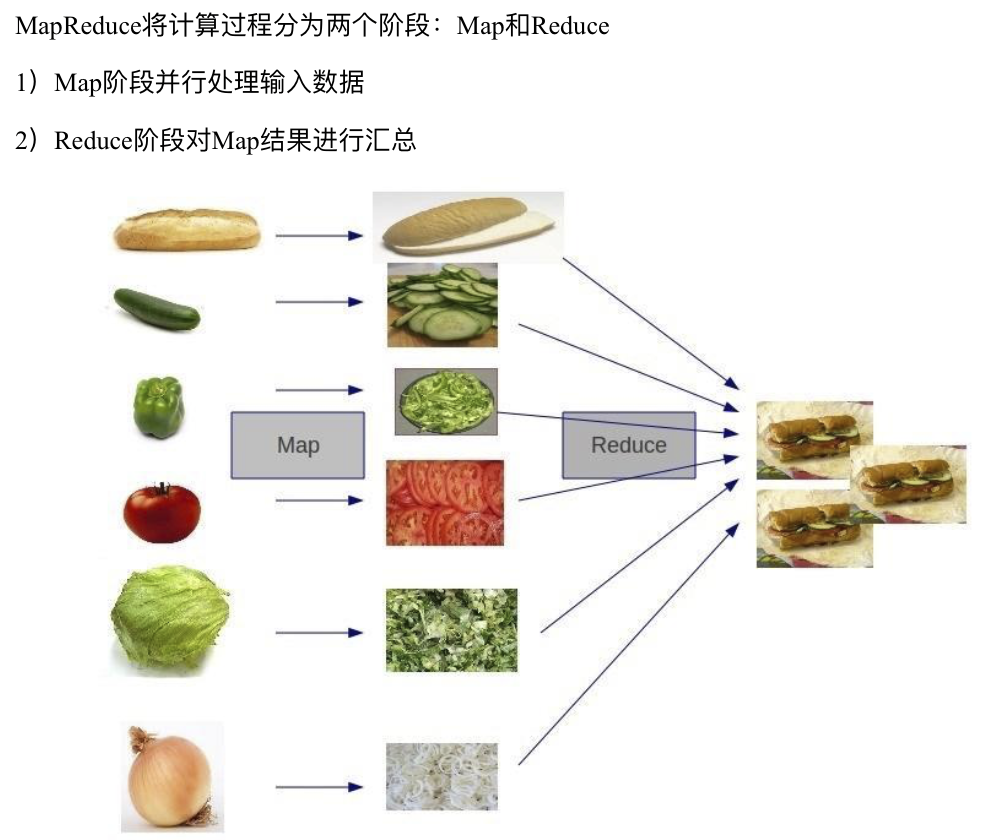
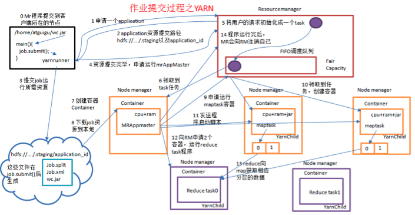
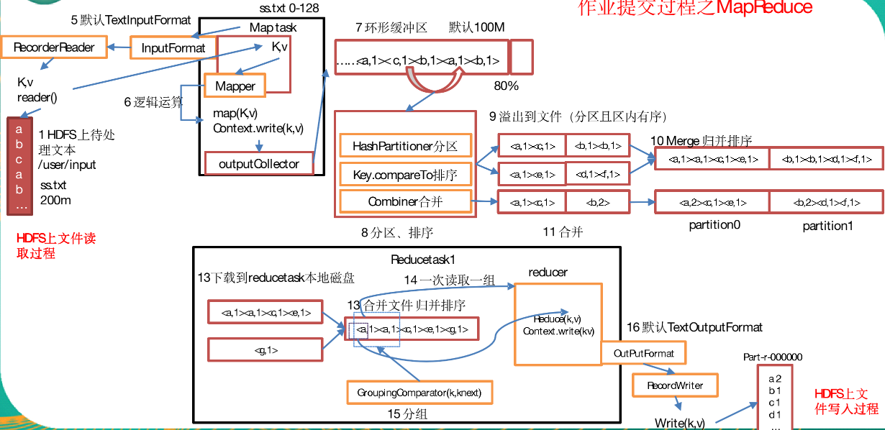

为什么要使用 MapReduce框架
``` 
1.海量数据处理，在单机上受限于硬件资源，无法胜任，一旦扩展到分布式运算，将极大增加程序计算运行的复杂度，通过引入 MR 框架，可以很方便协调通信管理，屏蔽节点通信，数据交换，工作协调细节，让程序员把精力集中到业务开发上；
2.MR 框架预留出足够多的模块接口，能很方便自定义槽子，充分满足各种自定义需求；
3.通过编译源码，能很方便与第三方服务整合，扩展功能；
4.社区十分活跃，应用性能可靠，前景广阔
```



MR 框架使用需要注意事项：
```
1.整个数据处理过程，是否可以拆分为先分后合的处理流程；
2.如何控制分阶段(map)，合阶段(reduce)的并行度；
3.负责业务需求，能否拆分成多个 MR 任务链式处理，以及各阶段目标实现规划；
4.MR 任务优化方向：
    a.小文件过多，可以合并，优化分片策略；
    b.map 节点预合并，减少 shuffle 的数据传输，reduce 节点计算压力；
    c.自定义分区策略，控制 reduce 并行度；
    d.分组排序，减轻 reduce 段计算压力;
    e.文件输入输出使用压缩，优化数据存储和传输。
```

MR 作业提交之 YARN
``` 
0.MR 程序提交到集群，返回 YarnRunner ；
1.YarnRunner 向 ResourceManager 申请 application，运行 MR 程序;
2.ResourceManager 返回 MR 程序上传资源路径给 YarnRunner;
3.YarnRunner 上传资源到 ResourceManager 返回的路径，其中包括 MR程序 jar，输入文件 job.split，自定义配置文件 job.xml；
4.YarnRunner 资源提交完毕，向 ResourceManager 申请运行 MRAppMaster;
5.ResourceManager 将申请封装成 task，存入任务队列；
6.空闲 NodeManager 从任务队列领取此task，并创建Container，并在 Container中运行 MRAppMaster 角色相关进程；
7.MRAppMaster 下载YarnRunner 上传的资源，进过分析，指定 MR 程序执行计划，包括文件分片，map、reduce 阶段相关 task个数，文件输入、输出，压缩编码等信息；
8.MRAppMaster 向RM申请Container 运行 map-task （不同容器可能分配到同一个 NodeManager 上），
9.ResourceManager 筛选 NodeManager，并控制创建各自Container；
10.ResourceManager 向筛选出的 NodeManager 发送启动程序脚本，NodeManager 创建的Container分别运行 map task(read,partition,partition sorted);
11.map task 运行完毕 MRAppMaster 向 ResourceManager 申请相应数量容器(reduce task 个数一致)，运行 reduce task;
12.reduce task从map task 获取相应分区数据，并执行 reduce 操作(merge sorted,merge,write)；
13.程序运行完毕，MR 程序向 ResourceManager注销自己。
```



MR 作业提交之 MapReduce
```
0.Driver程序启动，返回MR 程序执行 Runner，本地运行返回 LocalRunner，集群运行返回 YarnRunner；
1.Runner 向RM申请application，RM返回 applicaion_id和上传文件路径；
2.Runner 上传提MR程序相关文件，其中包括待处理数据job.split、自定义配置 job.xml，此外YarnRunner 还需要上传封装 MR 任务的 jar;
3.Runner 向RM请求运行MR，RM 将请求封装成 task，存入任务队列；
4.空闲的 NodeManager 领取 task，创建 Container，产生了 MRAppMaster；
5.MRAppMaster 向RM申请运行 map task 的容器，RM 分配 NodeManager；
6.NodeManager 启动容器运行，下载MR 相关文件，执行 map-task
7.map task 节点，按行读取文件，默认为 TextInputFormat，key为起始字节长度，value为行文本，map 函数中处理，然后刷写到环形缓冲区(默认100M，负载超过80%换向存储，并将已有的刷写到文件落盘)；
8.环形缓冲区刷写文件前，执行分区(默认HashPartitioner)，排序(Partition Sortion)，必要时还有预聚合(Combiner)操作，输出的文件也是按分区分文件存储；
9.map task 执行完毕，MRAppMaster向RM申请运行 reduce task;
10.RM 分配 NodeManager，NodeManager 领取任务，启动容器，从各 map task节点下载属于自己的分区数据，然后合并排序(按key分组，组内排序)；
11.reduce 函数中，以组(key)为单位收集数据，执行相应逻辑 ；
12.结果落盘
```


WordCount实例
``` 
WCMapper 
WCReducer
WCDriver
```