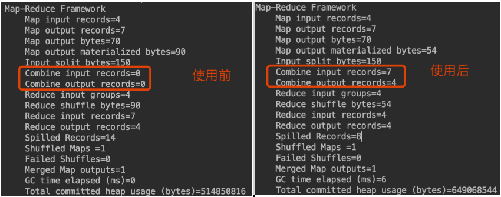

为什么要使用 MapReduce框架
``` 
1.海量数据处理，在单机上受限于硬件资源，无法胜任，一旦扩展到分布式运算，将极大增加程序计算运行的复杂度，通过引入 MR 框架，可以很方便协调通信管理，屏蔽节点通信，数据交换，工作协调细节，让程序员把精力集中到业务开发上；
2.MR 框架预留出足够多的模块接口，能很方便自定义槽子，充分满足各种自定义需求；
3.通过编译源码，能很方便与第三方服务整合，扩展功能；
4.社区十分活跃，应用性能可靠，前景广阔
```


MR 框架使用需要注意事项：
```
1.整个数据处理过程，是否可以拆分为先分后合的处理流程；
2.如何控制分阶段(map)，合阶段(reduce)的并行度；
3.负责业务需求，能否拆分成多个 MR 任务链式处理，以及各阶段目标实现规划；
4.MR 任务优化方向：
    a.小文件过多，可以合并，优化分片策略；
    b.map 节点预合并，减少 shuffle 的数据传输，reduce 节点计算压力；
    c.自定义分区策略，控制 reduce 并行度；
    d.分组排序，减轻 reduce 段计算压力;
    e.文件输入输出使用压缩，优化数据存储和传输。
```

MR 作业提交之 YARN
``` 
0.MR 程序提交到集群，返回 YarnRunner ；
1.YarnRunner 向 ResourceManager 申请 application，运行 MR 程序;
2.ResourceManager 返回 MR 程序上传资源路径给 YarnRunner;
3.YarnRunner 上传资源到 ResourceManager 返回的路径，其中包括 MR程序 jar，输入文件 job.split，自定义配置文件 job.xml；
4.YarnRunner 资源提交完毕，向 ResourceManager 申请运行 MRAppMaster;
5.ResourceManager 将申请封装成 task，存入任务队列；
6.空闲 NodeManager 从任务队列领取此task，并创建Container，并在 Container中运行 MRAppMaster 角色相关进程；
7.MRAppMaster 下载YarnRunner 上传的资源，进过分析，指定 MR 程序执行计划，包括文件分片，map、reduce 阶段相关 task个数，文件输入、输出，压缩编码等信息；
8.MRAppMaster 向RM申请Container 运行 map-task （不同容器可能分配到同一个 NodeManager 上），
9.ResourceManager 筛选 NodeManager，并控制创建各自Container；
10.ResourceManager 向筛选出的 NodeManager 发送启动程序脚本，NodeManager 创建的Container分别运行 map task(read,partition,partition sorted);
11.map task 运行完毕 MRAppMaster 向 ResourceManager 申请相应数量容器(reduce task 个数一致)，运行 reduce task;
12.reduce task从map task 获取相应分区数据，并执行 reduce 操作(merge sorted,merge,write)；
13.程序运行完毕，MR 程序向 ResourceManager注销自己。
```


MR 作业提交之 MapReduce
```
0.Driver程序启动，返回MR 程序执行 Runner，本地运行返回 LocalRunner，集群运行返回 YarnRunner；
1.Runner 向RM申请application，RM返回 applicaion_id和上传文件路径；
2.Runner 上传提MR程序相关文件，其中包括待处理数据job.split、自定义配置 job.xml，此外YarnRunner 还需要上传封装 MR 任务的 jar;
3.Runner 向RM请求运行MR，RM 将请求封装成 task，存入任务队列；
4.空闲的 NodeManager 领取 task，创建 Container，产生了 MRAppMaster；
5.MRAppMaster 向RM申请运行 map task 的容器，RM 分配 NodeManager；
6.NodeManager 启动容器运行，下载MR 相关文件，执行 map-task
7.map task 节点，按行读取文件，默认为 TextInputFormat，key为起始字节长度，value为行文本，map 函数中处理，然后刷写到环形缓冲区(默认100M，负载超过80%换向存储，并将已有的刷写到文件落盘)；
8.环形缓冲区刷写文件前，执行分区(默认HashPartitioner)，排序(Partition Sortion)，必要时还有预聚合(Combiner)操作，输出的文件也是按分区分文件存储；
9.map task 执行完毕，MRAppMaster向RM申请运行 reduce task;
10.RM 分配 NodeManager，NodeManager 领取任务，启动容器，从各 map task节点下载属于自己的分区数据，然后合并排序(按key分组，组内排序)；
11.reduce 函数中，以组(key)为单位收集数据，执行相应逻辑 ；
12.结果落盘

```


[WordCount实例](https://github.com/GitHuHao/hadoop/blob/master/hdfs-practice/src/com/bigdata/hadoop/hdfs-practice/src/com/bigdata/hadoop/mr/wordcount/local)
``` 
WCMapper 
WCReducer
WCDriver
```


[自定义奇偶分区](https://github.com/GitHuHao/hadoop/blob/master/hdfs-practice/src/com/bigdata/hadoop/hdfs-practice/src/com/bigdata/hadoop/mr/partitioner/local)
``` 
AsciiSortDriver
AsciiSortMapper
AsciiSortPartitioner
AsciiSortReducer

map 输出 kv，先进入环形缓冲区，当累计量到达阈值80%，溢写到文件，溢写过程只需分区和区内排序操作，溢写文件最终在mapper 节点按分区进行合并

要点：
1.实现 Partitioner<Text, IntWritable> 抽象类，要求分配的分区是从 0 开始连续的 (默认按 HashPartitioner -> key.toString().hashCode() % reduceNum);
2.Driver中注册分区类，和分区数
    job.setPartitionerClass(AsciiSortPartitioner.class);
    job.setNumReduceTasks(2);
3.默认 reduce task 个数要与分区数一致，当 reduce task > partitionNum 时，部分 reduce节点会空转，产生空结果文件，当 reduce task < partitionNum 时，
会出现异常，当 reduce task =1 时，不进行分区，产生一个结果文件
```

[预聚合](https://github.com/GitHuHao/hadoop/blob/master/hdfs-practice/src/com/bigdata/hadoop/hdfs-practice/src/com/bigdata/hadoop/mr/combiner/local)
``` 
Combiner
CombinerDriver1
CombinerDriver2
CombinerMapper
CombinerReducer

map 输出的 kv,在 shuffle 之前先在 mapper节点进行预聚合操作，减少 shuffle 过程数据的网络传输量，预聚合逻辑适合做累计操作；

CombinerDriver1 参考 Reducer 逻辑，自定义 Combiner

CombinerDriver2 直接将 Reducer 注册为 Combiner。

----------------------------------------------
Map-Reduce Framework
		Map input records=4
		Map output records=7
		Map output bytes=70
		Map output materialized bytes=54
		Input split bytes=150
		Combine input records=7
		Combine output records=4
		Reduce input groups=4
		Reduce shuffle bytes=54
		Reduce input records=4
		Reduce output records=4
		Spilled Records=8
		Shuffled Maps =1
		Failed Shuffles=0
		Merged Map outputs=1
		GC time elapsed (ms)=0
		Total committed heap usage (bytes)=514850816
----------------------------------------------

```


[分片优化（合并小文件）](https://github.com/GitHuHao/hadoop/blob/master/hdfs-practice/src/com/bigdata/hadoop/hdfs-practice/src/com/bigdata/hadoop/mr/split/local)
``` 
WCDriver
WCMapper
WCReducer

1.需要 MR 处理的文件，默认按 TextInputFormat 按行读取，单个文件超过 128M 时，要拆分为多个 分片，有不同 mapper 节点处理，小于 128M 时，直接将整个文件作为一个分片交给一个 mapper处理； 
2.小文件过多，产生 map task 太多，而且每个又没有被充分使用，浪费计算资源；
3.使用 CombineTextInputFormat 读取文件，设置分片上下界，从小到大合并输入文件，将合并后整体提交到一个 mapper 处理，减少了 map task 个数，提高计算效率；

----------------------------------------------
[org.apache.hadoop.mapreduce.JobSubmitter] - number of splits:3 合并前 
[org.apache.hadoop.mapreduce.JobSubmitter] - number of splits:1 合并后
----------------------------------------------
```

序列化
``` 
boolean -> BooleanWritable
byte -> ByteWritable
int -> IntWritable
float -> FloatWritable
long -> LongWritable
double -> DoubleWritable
String -> Text
map -> MapWritable
array -> ArrayWritable 
```

自定义序列化 Bean
``` 
1.实现Writable 接口；
2.重写序列化和反序列化方法，且序列化和反序列化顺序完全一致；
3.提供空参构造区（反序列化时，会调用）；
4.结果需要写文件时，以 TSV 格式重写 toString 方法；
5.bean 需要作为 key传输时，要实现 Comparable 接口，因为 shufle 过程会对key 进行排序
```

[手机上行流量，下行流量，总流量统计](https://github.com/GitHuHao/hadoop/blob/master/hdfs-practice/src/com/bigdata/hadoop/hdfs-practice/src/com/bigdata/hadoop/bean/wordcount/local)

``` 
FlowBean
SumDriver
SumMapper
SumReducer
```

[全局排序](https://github.com/GitHuHao/hadoop/blob/master/hdfs-practice/src/com/bigdata/hadoop/hdfs-practice/src/com/bigdata/hadoop/bean/globalsort/local)
``` 
FlowBean
GlobalSortDriver
```

[自定义分区](https://github.com/GitHuHao/hadoop/blob/master/hdfs-practice/src/com/bigdata/hadoop/hdfs-practice/src/com/bigdata/hadoop/bean/partitioner/local)
``` 
FlowBean
ProvincePartitioner
SumDriver
SumMapper
SumReducer
```

[分区排序](https://github.com/GitHuHao/hadoop/blob/master/hdfs-practice/src/com/bigdata/hadoop/hdfs-practice/src/com/bigdata/hadoop/bean/partitionsort/local)
``` 
FlowBean
PartitionSortDriver
```

[辅助排序取最大值](https://github.com/GitHuHao/hadoop/blob/master/hdfs-practice/src/com/bigdata/hadoop/hdfs-practice/src/com/bigdata/hadoop/bean/groupingcomparator/local)
``` 
MaxPriceItemDriver
OrderBean
```

[MR实现 reduce 端JOIN 操作](https://github.com/GitHuHao/hadoop/blob/master/hdfs-practice/src/com/bigdata/hadoop/hdfs-practice/src/com/bigdata/hadoop/join/reduceside/local)
```
JoinDriver
JoinMapper
JoinReducer
TableBean 

容易出现数据倾斜
```

[MR实现 map 端JOIN 操作](https://github.com/GitHuHao/hadoop/blob/master/hdfs-practice/src/com/bigdata/hadoop/hdfs-practice/src/com/bigdata/hadoop/join/mapside/local)
```
JoinDriver
JoinMapper
TableBean

使用分布式缓存策略，提交计算效率
```

[MR小文件优化(合并文件作为一个切片)](https://github.com/GitHuHao/hadoop/blob/master/hdfs-practice/src/com/bigdata/hadoop/hdfs-practice/src/com/bigdata/hadoop/split/combine/local)
```
WCDriver
WCMapper
WCReducer

输入选用CombineTextInputFormat，通过设置上下界，按从小到大顺序合并小文件，减少 map task 个数，提高计算效率 
```

[MR小文件优化(先使用 MR合并小文件，然后在对合并后文件进行 MR 计算)](https://github.com/GitHuHao/hadoop/blob/master/hdfs-practice/src/com/bigdata/hadoop/hdfs-practice/src/com/bigdata/hadoop/split/sequence/local)
```
自定义输入格式(文件不分片，且分片整体一次性读取)
WholeRecordReader
WholeFileInputFormat

以 SequenceFileOutputFormat 格式输出
GatherMapper
SequenceOutputDriver

以 SequenceFileInputFormat 格式读取，然后执行 MR 任务
WCDriver
WCMapper
WCReducer

串行两个 MR
LinkedDriver
```

[MR过滤分流文件](https://github.com/GitHuHao/hadoop/blob/master/hdfs-practice/src/com/bigdata/hadoop/hdfs-practice/src/com/bigdata/hadoop/filter/output/local)
```
ContentFilterDriver
ContentFilterOutputFormat
ContentFilterWriter
基于关键字分流文件
```

[MR简单日志清洗](https://github.com/GitHuHao/hadoop/blob/master/hdfs-practice/src/com/bigdata/hadoop/hdfs-practice/src/com/bigdata/hadoop/filter/logclean/local)
```
LogDriver
LogMapper
```

[MR复杂日志清洗](https://github.com/GitHuHao/hadoop/blob/master/hdfs-practice/src/com/bigdata/hadoop/hdfs-practice/src/com/bigdata/hadoop/filter/logclean2/local)
```
LogBean
LogDriver
LogMapper
TestSplit
```

[MR倒排索引(分区取决于bean compareTo)](https://github.com/GitHuHao/hadoop/blob/master/hdfs-practice/src/com/bigdata/hadoop/hdfs-practice/src/com/bigdata/hadoop/reversed/index1/local)
```
GatherDriver
GatherMapper
GatherReducer
WCDriver
WCMapper
WCReducer
WordBean
```

[MR倒排索引(分区取决于辅助排序 compare)](https://github.com/GitHuHao/hadoop/blob/master/hdfs-practice/src/com/bigdata/hadoop/hdfs-practice/src/com/bigdata/hadoop/reversed/index2/local)
```
GatherDriver
GatherGroupingComparator
GatherMapper
GatherReducer
WCDriver
WCMapper
WCReducer
WordBean
```

[MR求共同好友](https://github.com/GitHuHao/hadoop/blob/master/hdfs-practice/src/com/bigdata/hadoop/hdfs-practice/src/com/bigdata/hadoop/friend/shared/local)
```
FriendMeDriver
FriendMeMapper
FriendMeReducer
MeMeFriendDriver
MeMeFriendMapper
MeMeFriendReducer
```


