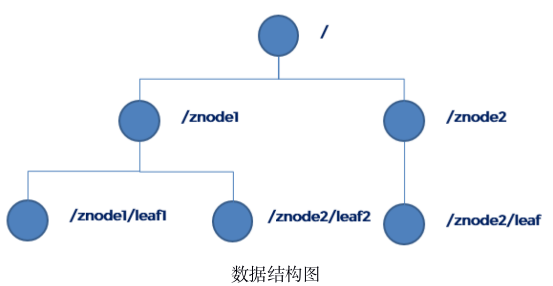
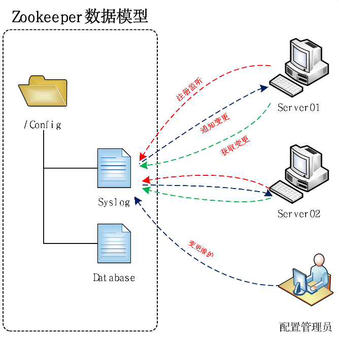
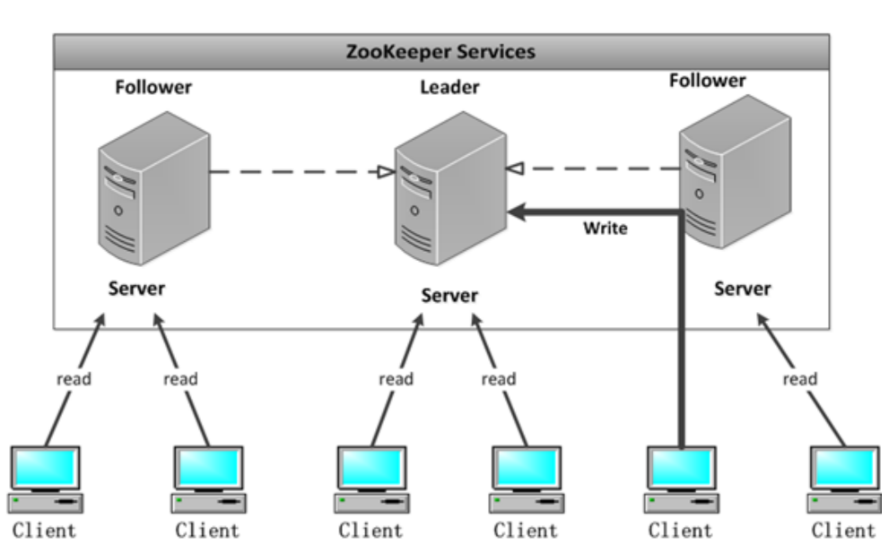
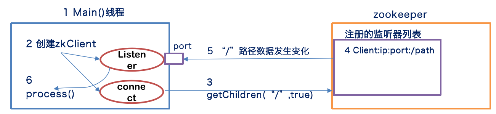
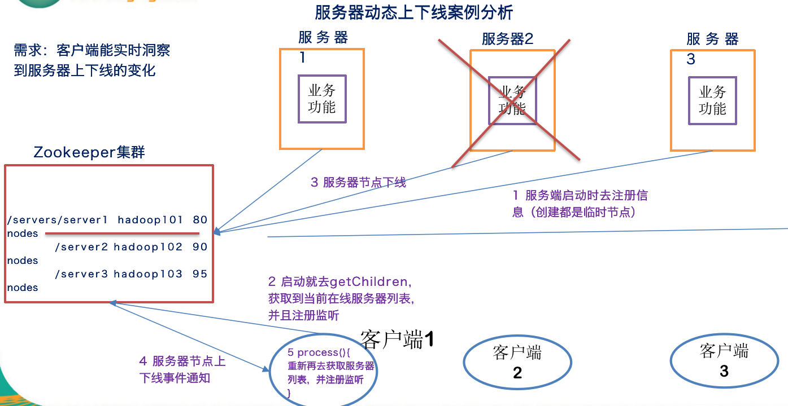
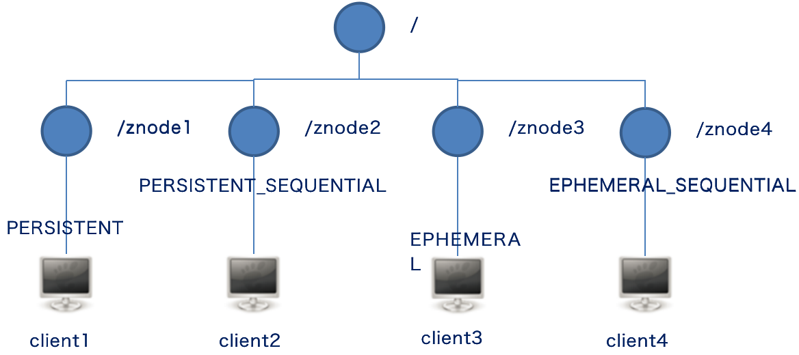
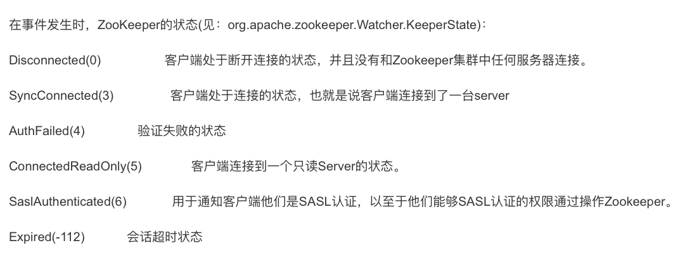
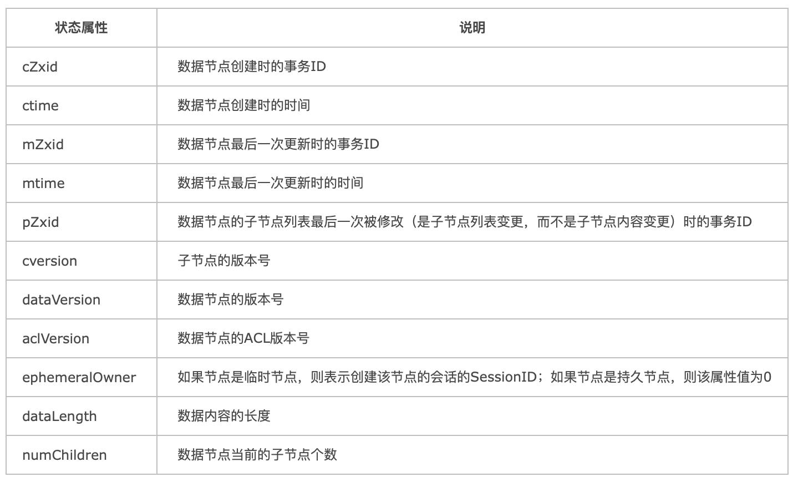
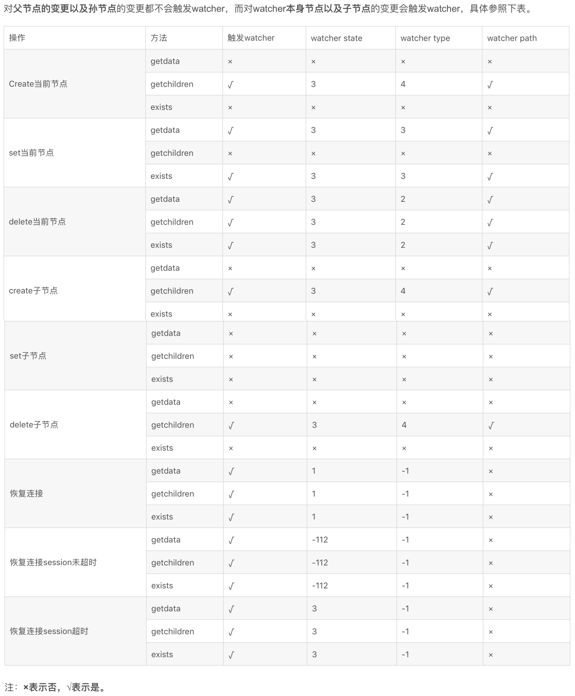

是什么？
``` 
Zookeeper 是一个开源分布式的旨在为分布式应用提供协调服务的 Apache 项目。从设计模式来说，它是记忆观察者模式设计的分布式管理框架。zookeepeer 只负责存储和管理大家最关心的数据，
然后接受观察者的注册，一旦这些数据发送变化，zookeeper 就负责通知注册的观察者，从而实现分布式应用 Master/Slave 管理模式。

Zookeeper = 文件系统 + 通知机制。
```

特点
``` 
1. zookeeper 集群由一个领导者 leader，多个跟随者 follower 组成；
2. leader 负责投票发起和决议，更新系统状态；
3. follower 负责接受客户端请求，并返回结果，在选举 leader 时参与投票；
4. 集群中只要存在半数以上节点存活，zookeeper 就可正常对外提供服务;
5. 全局数据一致，每个 server 保持一份相同内容数据副本，client 无论连接哪个 server ，读取数都是一致的；
6. 更新请求来自同一个客户端时，顺序执行；
7. 数据更新具备原子性，要么都成功，要么都失败；
8. 实时性，在一定时间段内，client 能读取到最新数据。
```

数据结构
``` 
ZooKeeper数据模型的结构与Unix文件系统很类似，整体上可以看作是一棵树，每个节点称做一个ZNode。 很显然zookeeper集群自身维护了一套数据结构。这个存储结构是一个树形结构，其上的每一个节点，我们称之为"znode"，每一个znode默认能够存储1MB的数据，每个ZNode都可以通过其路径唯一标识
```


数据发布订阅场景
``` 
中心化配置（推拉模式）
1. 应用程序启动主动注册到 zookeeper，获取配置信息，并注册 Watch 监听;
2. 配置管理员变更 zookeeper 上的配置内容；
3. zookeeper 以触发 Watcher 回调函数方式，推送变更到应用；
4. 应用根据逻辑，主动获取新配置信息，然后更新自身逻辑。

适用于多设备共享信息，信息会经常发生变动场景。
```


软负载均衡场景
``` 
1. Register 负责域名注册吗，服务启动后将域名通过 Register 注册到 zookeeper 相应域名服务下；
2. Scanner 通过定时监测服务状态，动态更新节点地址信息；
3. Dispatcher 负责域名解析，实现软负载均衡；
4. Monitor 负责收集服务信息与状态监控；
5. Controller 提供后台 Console，提供配置管理功能.
```


集群管理场景
``` 
1 有多少机器在工作？
2 每台机器的运行状态收集
3 对集群中设备进行上下线操作。
4 分布式任务的状态汇报
```


zookeeper 监听器工作原理
``` 
1 应用访问集创建客户端同时，注册监听器；
2 zookeeper集群接受到客户端连接请求，将客户端监听器合并到监听列表；
3 客户端调用函数，获取信息同时，顺便决定是否启用监听器，当启用监听器时，客户端先收到本次请求信息，然后需要一个阻塞进程；
4 zookeeper 集群收到客户端启用监听器请求时，一旦信息，变更会回调客户端注册监听器 process 函数，通过客户端信息的变更；
5 客户端服务监听触发只能启用一次，等待被触发一次，之后要想继续被触发，需要连续启用。
```


服务器动态上下线示意图
```
1 服务端启动，访问 zookeeper 集群，创建临时节点注册信息；
2 客户端启动，创建 zk 连接，并同时注册回调函数，然后调用 getChildren 获取当前服务器列表，声明启用监听器；
3 服务端某节点上下线，导致 zookeeper 集群信息变更;
4 zookeeper 将变更信息，以回调 process 方式通知客户端
```


四种znode节点
``` 
PERSISTENT: 持久节点 
PERSISTENT_SEQUENTIAL: 持久序列化节点
EPHEMERAL: 临时节点
EPHEMERAL_SEQUENTIAL: 临时序列化节点
```




单机版部署
``` 
下载 zookeeper-3.4.5.tar.gz
链接: https://pan.baidu.com/s/1nhJsFVubH2EXRIILDBOcpA 提取码: j8hi 复制这段内容后打开百度网盘手机App，操作更方便哦

$ tar -zxvf zookeeper-3.4.5.tar.gz -C /opt/softwares

$ cd /opt/softwares/zookeeper-3.4.5

配置
$ mv conf/zoo_sample.cfg conf/zoo.cfg

$ vim conf/zoo.cfg
----------------------------------------------
# The number of milliseconds of each tick (心跳间隔)
tickTime=2000
# The number of ticks that the initial 
# synchronization phase can take （初始化 心跳数）
initLimit=10
# The number of ticks that can pass between 
# sending a request and getting an acknowledgement （请求超时心跳数）
syncLimit=5
# the directory where the snapshot is stored.
# do not use /tmp for storage, /tmp here is just 
# example sakes. 数据目录 <<<<
dataDir=data
# the port at which the clients will connect 客户端连接端口 
clientPort=2181
#
# Be sure to read the maintenance section of the 
# administrator guide before turning on autopurge.
#
# http://zookeeper.apache.org/doc/current/zookeeperAdmin.html#sc_maintenance
#
# The number of snapshots to retain in dataDir
#autopurge.snapRetainCount=3
# Purge task interval in hours
# Set to "0" to disable auto purge feature
#autopurge.purgeInterval=1
----------------------------------------------

创建目录
$ mkdir data 

注册环境
$ vim /etc/profile
----------------------------------------------
# zookeeper 
export ZOOKEEPER_HOME="/opt/softwares/zookeeper-3.4.5"
export PATH=$PATH:$ZOOKEEPER_HOME/bin
----------------------------------------------

$ source /etc/profile

$ vim /etc/bashrc
----------------------------------------------
# zookeeper 
export ZOOKEEPER_HOME="/opt/softwares/zookeeper-3.4.5"
export PATH=$PATH:$ZOOKEEPER_HOME/bin
----------------------------------------------

$ source /etc/bashrc

# 启动
$ bin/zkServer.sh start 

# 查看状态
$ bin/zkServer.sh status

# 停止
$ bin/zkServer.sh stop

# 客户端本地连接
$ bin/zkCli.sh  

# 客户端远程连接
$ zkCli.sh -server ip:2181

```

集群部署
``` 
$ cd /opt/softwares/zookeeper-3.4.5

$ vim conf/zoo.cfg
----------------------------------------------
# The number of milliseconds of each tick
tickTime=2000
# The number of ticks that the initial 
# synchronization phase can take
initLimit=10
# The number of ticks that can pass between 
# sending a request and getting an acknowledgement
syncLimit=5
# the directory where the snapshot is stored.
# do not use /tmp for storage, /tmp here is just 
# example sakes.
dataDir=data
# the port at which the clients will connect
clientPort=2181
#
# Be sure to read the maintenance section of the 
# administrator guide before turning on autopurge.
#
# http://zookeeper.apache.org/doc/current/zookeeperAdmin.html#sc_maintenance
#
# The number of snapshots to retain in dataDir
#autopurge.snapRetainCount=3
# Purge task interval in hours
# Set to "0" to disable auto purge feature
#autopurge.purgeInterval=1
# 2888 集群节点通信端口，3888 选举端口
server.1=hadoop01:2888:3888
server.2=hadoop02:2888:3888
server.3=hadoop03:2888:3888
----------------------------------------------

$ mkdir data

$ touch data/myid

分发
$ xsync /opt/softwares/zookeeper-3.4.5

设置 id (三个节点分别设置 1、2、3)
$ vim data/myid

辅助脚本
$ vim bin/zkStart.sh
----------------------------------------------
#!/bin/bash

xcall zkServer.sh status

xcall "cd $ZOOKEEPER_HOME;bin/zkServer.sh start"

sleep 2

xcall zkServer.sh status

----------------------------------------------

$ vim bin/zkStop.sh
----------------------------------------------
#!/bin/bash

xcall zkServer.sh status

xcall "cd $ZOOKEEPER_HOME;bin/zkServer.sh stop"

sleep 2

xcall zkServer.sh status

----------------------------------------------

$ chmod 755 bin/{zkStart.sh,zkStop.sh}

启动
$ zkStart.sh 
----------------------------------------------
>>> ssh admin@hadoop01 "cd /opt/softwares/zookeeper-3.4.5; zkServer.sh status"
JMX enabled by default
Using config: /opt/softwares/zookeeper-3.4.5/bin/../conf/zoo.cfg
Error contacting service. It is probably not running.

>>> ssh admin@hadoop02 "cd /opt/softwares/zookeeper-3.4.5; zkServer.sh status"
JMX enabled by default
Using config: /opt/softwares/zookeeper-3.4.5/bin/../conf/zoo.cfg
Error contacting service. It is probably not running.

>>> ssh admin@hadoop03 "cd /opt/softwares/zookeeper-3.4.5; zkServer.sh status"
JMX enabled by default
Using config: /opt/softwares/zookeeper-3.4.5/bin/../conf/zoo.cfg
Error contacting service. It is probably not running.

>>> ssh admin@hadoop01 "cd /opt/softwares/zookeeper-3.4.5; cd /opt/softwares/zookeeper-3.4.5;bin/zkServer.sh start"
JMX enabled by default
Using config: /opt/softwares/zookeeper-3.4.5/bin/../conf/zoo.cfg
Starting zookeeper ... STARTED

>>> ssh admin@hadoop02 "cd /opt/softwares/zookeeper-3.4.5; cd /opt/softwares/zookeeper-3.4.5;bin/zkServer.sh start"
JMX enabled by default
Using config: /opt/softwares/zookeeper-3.4.5/bin/../conf/zoo.cfg
Starting zookeeper ... STARTED

>>> ssh admin@hadoop03 "cd /opt/softwares/zookeeper-3.4.5; cd /opt/softwares/zookeeper-3.4.5;bin/zkServer.sh start"
JMX enabled by default
Using config: /opt/softwares/zookeeper-3.4.5/bin/../conf/zoo.cfg
Starting zookeeper ... STARTED

>>> ssh admin@hadoop01 "cd /opt/softwares/zookeeper-3.4.5; zkServer.sh status"
JMX enabled by default
Using config: /opt/softwares/zookeeper-3.4.5/bin/../conf/zoo.cfg
Mode: follower

>>> ssh admin@hadoop02 "cd /opt/softwares/zookeeper-3.4.5; zkServer.sh status"
JMX enabled by default
Using config: /opt/softwares/zookeeper-3.4.5/bin/../conf/zoo.cfg
Mode: leader   <<<< 

>>> ssh admin@hadoop03 "cd /opt/softwares/zookeeper-3.4.5; zkServer.sh status"
JMX enabled by default
Using config: /opt/softwares/zookeeper-3.4.5/bin/../conf/zoo.cfg
Mode: follower
----------------------------------------------

停机
$ zkStop.sh
----------------------------------------------
>>> ssh admin@hadoop01 "cd /opt/softwares/zookeeper-3.4.5; zkServer.sh status"
JMX enabled by default
Using config: /opt/softwares/zookeeper-3.4.5/bin/../conf/zoo.cfg
Mode: follower

>>> ssh admin@hadoop02 "cd /opt/softwares/zookeeper-3.4.5; zkServer.sh status"
JMX enabled by default
Using config: /opt/softwares/zookeeper-3.4.5/bin/../conf/zoo.cfg
Mode: leader

>>> ssh admin@hadoop03 "cd /opt/softwares/zookeeper-3.4.5; zkServer.sh status"
JMX enabled by default
Using config: /opt/softwares/zookeeper-3.4.5/bin/../conf/zoo.cfg
Mode: follower

>>> ssh admin@hadoop01 "cd /opt/softwares/zookeeper-3.4.5; cd /opt/softwares/zookeeper-3.4.5;bin/zkServer.sh stop"
JMX enabled by default
Using config: /opt/softwares/zookeeper-3.4.5/bin/../conf/zoo.cfg
Stopping zookeeper ... STOPPED

>>> ssh admin@hadoop02 "cd /opt/softwares/zookeeper-3.4.5; cd /opt/softwares/zookeeper-3.4.5;bin/zkServer.sh stop"
JMX enabled by default
Using config: /opt/softwares/zookeeper-3.4.5/bin/../conf/zoo.cfg
Stopping zookeeper ... STOPPED

>>> ssh admin@hadoop03 "cd /opt/softwares/zookeeper-3.4.5; cd /opt/softwares/zookeeper-3.4.5;bin/zkServer.sh stop"
JMX enabled by default
Using config: /opt/softwares/zookeeper-3.4.5/bin/../conf/zoo.cfg
Stopping zookeeper ... STOPPED

>>> ssh admin@hadoop01 "cd /opt/softwares/zookeeper-3.4.5; zkServer.sh status"
JMX enabled by default
Using config: /opt/softwares/zookeeper-3.4.5/bin/../conf/zoo.cfg
Error contacting service. It is probably not running.

>>> ssh admin@hadoop02 "cd /opt/softwares/zookeeper-3.4.5; zkServer.sh status"
JMX enabled by default
Using config: /opt/softwares/zookeeper-3.4.5/bin/../conf/zoo.cfg
Error contacting service. It is probably not running.

>>> ssh admin@hadoop03 "cd /opt/softwares/zookeeper-3.4.5; zkServer.sh status"
JMX enabled by default
Using config: /opt/softwares/zookeeper-3.4.5/bin/../conf/zoo.cfg
Error contacting service. It is probably not running.
----------------------------------------------

```

常用命令
```
登录
$ zkCli.sh [-server ip:2181]

查看指定路径下节点
[zk: localhost:2181(CONNECTED) 0] ls /
[zookeeper]

创建节点（
1.创建节点必须存储数据；
2.路径以'/'开头；
3.默认创建持久节点，已经存在的会报错；
4.-s 创建自增序列节点，不会重复；
5.-e 创建临时节点，session 关闭，节点消失，临时节点下不能创建子节点
）
[zk: localhost:2181(CONNECTED) 3] create /tom 'name'
Created /tom

获取节点存储值 和 信息
[zk: localhost:2181(CONNECTED) 4] get /tom
'name'
cZxid = 0xa00000002
ctime = Mon Oct 14 23:32:11 CST 2019
mZxid = 0xa00000002
mtime = Mon Oct 14 23:32:11 CST 2019
pZxid = 0xa00000002
cversion = 0
dataVersion = 0
aclVersion = 0
ephemeralOwner = 0x0
dataLength = 6
numChildren = 0

创建子节点
[zk: localhost:2181(CONNECTED) 5] create /tom/name 'b'  
Created /tom/name


[zk: localhost:2181(CONNECTED) 7] ls /tom
[name]

查看子节点同时返回节点状态信息
[zk: localhost:2181(CONNECTED) 6] ls2 /tom
[name]
cZxid = 0xa00000002
ctime = Mon Oct 14 23:32:11 CST 2019
mZxid = 0xa00000002
mtime = Mon Oct 14 23:32:11 CST 2019
pZxid = 0xa00000005
cversion = 1
dataVersion = 0
aclVersion = 0
ephemeralOwner = 0x0
dataLength = 6
numChildren = 1

修改值
[zk: localhost:2181(CONNECTED) 9] set /tom 'aa'
cZxid = 0xa00000002
ctime = Mon Oct 14 23:32:11 CST 2019
mZxid = 0xa00000006
mtime = Mon Oct 14 23:43:31 CST 2019
pZxid = 0xa00000005
cversion = 1
dataVersion = 1
aclVersion = 0
ephemeralOwner = 0x0
dataLength = 4
numChildren = 1

获取状态
[zk: localhost:2181(CONNECTED) 11] stat /tom
cZxid = 0xa00000002
ctime = Mon Oct 14 23:32:11 CST 2019
mZxid = 0xa00000006
mtime = Mon Oct 14 23:43:31 CST 2019
pZxid = 0xa00000005
cversion = 1
dataVersion = 1
aclVersion = 0
ephemeralOwner = 0x0
dataLength = 4
numChildren = 1

```



[ZookeeperAPI](https://github.com/GitHuHao/hadoop/tree/master/hdfs-practice/src/com/bigdata/zookeeper/exec)
``` 
Transaction
ZkTest
```

[ZookeeperWatcher](https://github.com/GitHuHao/hadoop/tree/master/hdfs-practice/src/com/bigdata/zookeeper/watch)
``` 
WatchTest
```



Zookeeper Watch
``` 
Watcher 设置是开发中最常见的，需要搞清楚watcher的一些基本特征，对于exists、getdata、getchild对于节点的不同操作会收到不同的 watcher信息

state=-112 会话超时状态
state= -113　认证失败状态
state=  1 连接建立中
state= 2 (暂时不清楚如何理解这个状态,ZOO_ASSOCIATING_STATE)
state=3 连接已建立状态
state= 999 无连接状态


type=1 创建节点事件
type=2 删除节点事件
type=3 更改节点事件
type=4 子节点列表变化事件
type= -1 会话session事件
type=-2 监控被移除事件
————————————————
版权声明：本文为CSDN博主「天祺6666」的原创文章，遵循 CC 4.0 BY-SA 版权协议，转载请附上原文出处链接及本声明。
原文链接：https://blog.csdn.net/qq_23034755/article/details/91968814
```


