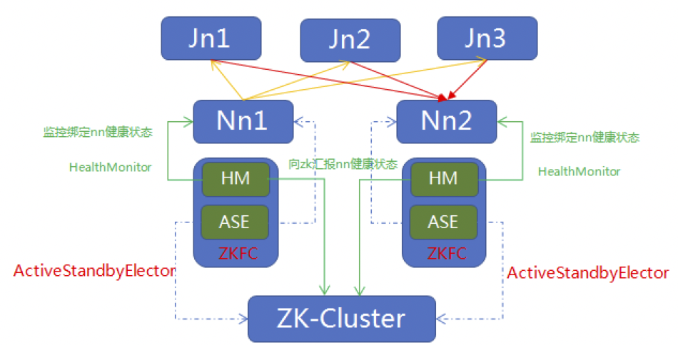
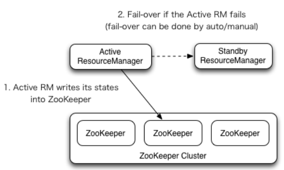

为什么要实行 HA配置？
``` 
1.NameNode机器发生意外，如宕机，集群将无法使用，直到管理员重启；
2.NameNode机器需要升级，包括软件、硬件升级，此时集群也将无法使用。
HDFS HA功能通过配置Active/Standby两个NameNodes实现在集群中对NameNode的热备来解决上述问题。如果出现故障，如机器崩溃或机器需要升级维护，这时可通过此种方式将NameNode很快的切换到另外一台机器。
```

HDFS-HA
``` 
目标：通过配置多个 Namenode 消除单点故障。
工作特点：
1.元数据管理方式改变：
    所有namenode各自内存保存一份元数据，编辑日志只在 Active Namenode 节点执行写操作，然后同步到共享存储管理(如 qjournal 和 NFS)。其余 Standby NameNode节点，从共享存储中同步元数据。
    Standby 节点元数据只读不写。
2.需要一个状态管理功能模块：
    实现zkfailover进程服务，且常驻Namnode所有节点，每个 zkfailover 负责监控字节 Namenode 节点，利用 zk进行状态标识，需要进行状态切换时，zkfailiover负责切换，防止出现脑裂；
3.必须保证所有 namenode 直接能够进行 ssh 无密登录；
4.启用 SSHFence（隔离），保证同一时刻只有一个 Namenode 对外提供服务。
```

HA 规划
``` 
    192.168.152.102 hadoop01 nodemanager datanode journalnode zookeeper namenode1 
    192.168.152.103 hadoop02 nodemanager datanode journalnode zookeeper namenode2 resourcemanager1 jobhistoryserver
    192.168.152.104 hadoop03 nodemanager datanode journalnode zookeeper           resourcemanager2
```

方案 1：HDFS-HA之手动切换
``` 
目录
$ cd /opt/softwares/hadoop-2.7.2

配置
    $ vim etc/hadoop/core-site.xml
    ----------------------------------------------
        <!-- 配置NameNode 节点,namenode 集群名称 hacluster -->
        <property>
            <name>fs.defaultFS</name>
            <value>hdfs://hacluster</value>
        </property>
        <!-- 配置数据目录 存放 nn dn,sn 数据-->
        <property>
           <name>hadoop.tmp.dir</name>
           <value>/opt/softwares/hadoop-2.7.2/data</value>
        </property>
        <!-- 修改访问回收站默认用户-->
        <property>
            <name>hadoop.http.staticuser.user</name>
            <value>admin</value>
        </property>
    ----------------------------------------------
    
    $ xsync etc/hadoop/core-site.xml
    
    $ vim etc/hadoop/hdfs-site.xml
    ----------------------------------------------
        <!-- 定义hdfs重要性略次于namenode节点的sn节点 -->
        <property>
            <name>dfs.namenode.secondary.http-address</name>
            <value>hadoop02:50090</value>
        </property>
        
        <!--  文件系统存储数据块的副本数,从此处体现出为伪布式特点 --> 
        <property>
            <name>dfs.replication</name>
            <value>3</value>
        </property>
        
        <!-- 默认每份数据块为3份副本,此处做试验,可以设置为1,节省资源(选配)-->
        <property> 
            <name>dfs.replication</name> 
            <value>3</value> 
        </property> 
        
        <!-- 关闭hdfs访问权限认证(选配:后期在java客户端操作时,关闭权限认证会比较方便) --> 
        <property> 
            <name>dfs.permissions.enabled</name> 
            <value>false</value> 
        </property> 
        
        <!--注册namenode集群名 --> 
        <property> 
            <name>dfs.nameservices</name> 
            <value>hacluster</value> 
        </property> 
        
        <!-- namenode 集群 节点名列表--> 
        <property> 
            <name>dfs.ha.namenodes.hacluster</name> 
            <value>nn1,nn2</value> 
        </property> 
        
        <!--nn节点间rpc通信 2.6之前为8020,之后为9000 --> 
        <property> 
            <name>dfs.namenode.rpc-address.hacluster.nn1</name> 
            <value>hadoop01:9000</value> 
        </property> 
        <property> 
            <name>dfs.namenode.rpc-address.hacluster.nn2</name> 
            <value>hadoop02:9000</value> 
        </property> 
        
        <!-- nn节点web服务 --> 
        <property> 
            <name>dfs.namenode.http-address.hacluster.nn1 </name> 
            <value>hadoop01:50070</value> 
        </property> 
        <property> 
            <name>dfs.namenode.http-address.hacluster.nn2</name> 
            <value>hadoop02:50070</value> 
        </property> 
        
        <!-- journalnode 节点 --> 
        <property> 
            <name>dfs.namenode.shared.edits.dir</name> 
            <value>qjournal://hadoop01:8485;hadoop02:8485;hadoop03:8485/hacluster</value> 
        </property> 
        
        <!-- 故障转移代理 --> 
        <property> 
            <name>dfs.client.failover.proxy.provider.hacluster</name> 
            <value>org.apache.hadoop.hdfs.server.namenode.ha.ConfiguredFailoverProxyProvider</value> 
        </property> 
        
        <!-- 启用ssh栅栏隔离,namenode集群通信,需要手动指明.ssh/id_rsa 私钥地址,需要ssh无密登录配合--> 
        <property> 
            <name>dfs.ha.fencing.methods</name> 
            <value>sshfence</value> 
        </property> 
        
        <!-- 私钥 --> 
        <property> 
            <name>dfs.ha.fencing.ssh.private-key-files</name> 
            <value>/home/admin/.ssh/id_rsa</value> 
        </property> 
        
        <!-- 声明journalnode服务器存储目录-->
        <property>
            <name>dfs.journalnode.edits.dir</name>
            <value>/opt/softwares/hadoop-2.7.2/data/jn</value>
        </property>
        
        <!-- 关闭权限检查-->
        <property>
            <name>dfs.permissions.enable</name>
            <value>false</value>
        </property>
    ----------------------------------------------
    
    $ xsync etc/hadoop/hdfs-site.xml

初始化
所有节点启动
$ xcall hadoop-daemon.sh start journalnode
$ xcall jps
----------------------------------------------
>>> ssh admin@hadoop01 "cd /opt/softwares/hadoop-2.7.2; jps"
64529 Jps
62779 JournalNode

>>> ssh admin@hadoop02 "cd /opt/softwares/hadoop-2.7.2; jps"
56260 Jps
54663 JournalNode

>>> ssh admin@hadoop03 "cd /opt/softwares/hadoop-2.7.2; jps"
51515 Jps
50622 JournalNode
----------------------------------------------

$ xcall ls data 
----------------------------------------------
>>> ssh admin@hadoop01 "cd /opt/softwares/hadoop-2.7.2; ls data"
jn

>>> ssh admin@hadoop02 "cd /opt/softwares/hadoop-2.7.2; ls data"
jn

>>> ssh admin@hadoop03 "cd /opt/softwares/hadoop-2.7.2; ls data"
jn
----------------------------------------------


主 Namenode 节点格式化（namenode1 namenode2 任选其一，此处选 namenode1,即 hadoop01）
$ hdfs namenode -format
----------------------------------------------
......
INFO common.Storage: Storage directory /opt/softwares/hadoop-2.7.2/data/dfs/name has been successfully formatted.
19/10/10 07:44:50 INFO namenode.NNStorageRetentionManager: Going to retain 1 images with txid >= 0
19/10/10 07:44:50 INFO util.ExitUtil: Exiting with status 0
19/10/10 07:44:50 INFO namenode.NameNode: SHUTDOWN_MSG: 
/************************************************************
SHUTDOWN_MSG: Shutting down NameNode at hadoop01/192.168.152.102
************************************************************/
----------------------------------------------

$ ls data
----------------------------------------------
>>> ssh admin@hadoop01 "cd /opt/softwares/hadoop-2.7.2; ls data"
dfs
jn

>>> ssh admin@hadoop02 "cd /opt/softwares/hadoop-2.7.2; ls data"
jn

>>> ssh admin@hadoop03 "cd /opt/softwares/hadoop-2.7.2; ls data"
jn
----------------------------------------------

启动主 Namenode 节点
$ hadoop-daemon.sh start namenode

备用 Namenode 节点从主节点同步元数据 (此处在 namenode2 执行，从 namenode1 同步操作)
$ hdfs namenode -bootstrapStandby
----------------------------------------------
.....
=====================================================
19/10/10 07:46:38 INFO common.Storage: Storage directory /opt/softwares/hadoop-2.7.2/data/dfs/name has been successfully formatted.
19/10/10 07:46:38 INFO namenode.TransferFsImage: Opening connection to http://hadoop01:50070/imagetransfer?getimage=1&txid=0&storageInfo=-63:1495453751:0:CID-0f4592b2-0904-4015-b5f6-e75937c9e276
19/10/10 07:46:38 INFO namenode.TransferFsImage: Image Transfer timeout configured to 60000 milliseconds
19/10/10 07:46:39 INFO namenode.TransferFsImage: Transfer took 0.01s at 0.00 KB/s
19/10/10 07:46:39 INFO namenode.TransferFsImage: Downloaded file fsimage.ckpt_0000000000000000000 size 352 bytes.
19/10/10 07:46:39 INFO util.ExitUtil: Exiting with status 0
19/10/10 07:46:39 INFO namenode.NameNode: SHUTDOWN_MSG: 
/************************************************************
SHUTDOWN_MSG: Shutting down NameNode at hadoop02/192.168.152.10
----------------------------------------------

$ ls data
----------------------------------------------
>>> ssh admin@hadoop01 "cd /opt/softwares/hadoop-2.7.2; ls data"
dfs
jn

>>> ssh admin@hadoop02 "cd /opt/softwares/hadoop-2.7.2; ls data"
dfs
jn

>>> ssh admin@hadoop03 "cd /opt/softwares/hadoop-2.7.2; ls data"
jn
----------------------------------------------

启动备用 namenode 节点
$ hadoop-daemon.sh start namenode

启动全部 datanode 节点
$ hadoop-daemon.sh start datanode

$ xcall jps
----------------------------------------------
>>> ssh admin@hadoop01 "cd /opt/softwares/hadoop-2.7.2; jps"
64529 Jps
63218 DataNode
64164 NameNode
62779 JournalNode

>>> ssh admin@hadoop02 "cd /opt/softwares/hadoop-2.7.2; jps"
56260 Jps
54885 NameNode
54663 JournalNode
55048 DataNode

>>> ssh admin@hadoop03 "cd /opt/softwares/hadoop-2.7.2; jps"
51515 Jps
50845 DataNode
50622 JournalNode
----------------------------------------------

将 namenode1 设置为 Active 状态(设置之前都是 Standby 状态)
----------------------------------------------
$ hdfs haadmin -transitionToActive nn1
----------------------------------------------

Active 从 namenode1 切换到 namenode2 （分别在 namenode1 namenode2 执行）
----------------------------------------------
$ hdfs namenode -bootstrapStandby nn1
$ hdfs namenode -transitionToActive nn2
----------------------------------------------

停机
$ xcall hadoop-daemon.sh stop journalnode
$ xcall hadoop-daemon.sh stop datanode
$ xcall hadoop-daemon.sh stop namenode

注：
1.开机必须手动指定 active 节点，其余节点均为 standby；
2.需要切换时，必须先将 active 节点转化为 standby 状态，然后才能指定其余节点为 active，之前 actitve 无法连接时，不能执行切换；

```

方案 2：HDFS-HA之自动切换
``` 
注：在上面自动切换基础上添加配置
$ vim  etc/hadoop/core-site.xml
----------------------------------------------
<!--添加 zk集群 -->
<property>
	<name>ha.zookeeper.quorum</name>
	<value>hadoop01:2181,hadoop02:2181,hadoop03:2181</value>
</property>
----------------------------------------------

$ xsync etc/hadoop/core-site.xml

$ vim etc/hadoop/hdfs-site.xml
----------------------------------------------
<!--允许故障自动转移-->
<property>
	<name>dfs.ha.automatic-failover.enabled</name>
	<value>true</value>
</property>
----------------------------------------------

$ xsync etc/hadoop/core-site.xml

启动 zk 集群
$ zkStart.sh

启动hdfs集群(单独启动每项服务需要使用 hadoop-daemon.sh start zkfc 启动 ZKFailoverController)
$ start-dfs.sh 
----------------------------------------------
Starting namenodes on [hadoop01 hadoop02]
hadoop02: starting namenode, logging to /opt/softwares/hadoop-2.7.2/logs/hadoop-admin-namenode-hadoop02.out
hadoop01: starting namenode, logging to /opt/softwares/hadoop-2.7.2/logs/hadoop-admin-namenode-hadoop01.out
hadoop02: starting datanode, logging to /opt/softwares/hadoop-2.7.2/logs/hadoop-admin-datanode-hadoop02.out
hadoop03: starting datanode, logging to /opt/softwares/hadoop-2.7.2/logs/hadoop-admin-datanode-hadoop03.out
hadoop01: starting datanode, logging to /opt/softwares/hadoop-2.7.2/logs/hadoop-admin-datanode-hadoop01.out
Starting journal nodes [hadoop01 hadoop02 hadoop03]
hadoop03: starting journalnode, logging to /opt/softwares/hadoop-2.7.2/logs/hadoop-admin-journalnode-hadoop03.out
hadoop02: starting journalnode, logging to /opt/softwares/hadoop-2.7.2/logs/hadoop-admin-journalnode-hadoop02.out
hadoop01: starting journalnode, logging to /opt/softwares/hadoop-2.7.2/logs/hadoop-admin-journalnode-hadoop01.out
Starting ZK Failover Controllers on NN hosts [hadoop01 hadoop02]
hadoop02: starting zkfc, logging to /opt/softwares/hadoop-2.7.2/logs/hadoop-admin-zkfc-hadoop02.out
hadoop01: starting zkfc, logging to /opt/softwares/hadoop-2.7.2/logs/hadoop-admin-zkfc-hadoop01.out
----------------------------------------------

$ xcall jps
----------------------------------------------
>>> ssh admin@hadoop01 "cd /opt/softwares/hadoop-2.7.2; jps"
68069 QuorumPeerMain
68869 DFSZKFailoverController
68490 DataNode
69178 Jps
68687 JournalNode

>>> ssh admin@hadoop02 "cd /opt/softwares/hadoop-2.7.2; jps"
59539 DataNode
59989 Jps
59302 QuorumPeerMain
59638 JournalNode
59758 DFSZKFailoverController
59455 NameNode

>>> ssh admin@hadoop03 "cd /opt/softwares/hadoop-2.7.2; jps"
53873 QuorumPeerMain
54337 Jps
54034 DataNode
54133 JournalNode
----------------------------------------------

$ hdfs haadmin -getServiceState nn1
active

$ hdfs haadmin -getServiceState nn2
standby

自动转移测试(此时浏览器显示 nn1 为 active，停止 nn1，发现自动切换到nn2，且 nn1再次复活，nn2 仍是 active)
$ hadoop-daemon.sh stop namenode

$ hadoop-daemon.sh start namenode

$ hdfs haadmin -getServiceState nn1
standby

$ hdfs haadmin -getServiceState nn2
active

```


```
1 JournalNode 节点负责替代 SecondaryNamenode 为Namenode节点执行Checkpoint操作,并发挥共享hdfs元数据功能;
 (注: Jn节点也遵循Paxos 算法,超过半数正常,Namenode 才能正常工作)
2 ZKFC 选举器,进程,开启HM,ASE 两个线程,HM负责实时监控其锁绑定的Nn节点的健康状态, ASE基本处于待机状态,一旦HM监控到Nn节点失联,由ZKFC通知Zk-Cluster,
 Zk-Cluster 命令 ZKFC 驱动 ASE 执行投票操作(Paxos),并通过回调返回票数,交给Zk-Cluster 统计,选举出新的Active-Nn节点;
3 Zk-Cluster 将选举结果,返回给ZKFS, 由ZKFC 驱动ASE 对绑定的Nn节点执行状态切换.
```


YARN HA 
``` 
注：在之前集群模式上添加
----------------------------------------------
<!--- shuffle 运行在 MR 上->
<property>
    <name>yarn.nodemanager.aux-services</name>
    <value>mapreduce_shuffle</value>
</property>

<!--开启 RM HA-->
<property>
    <name>yarn.resourcemanager.ha.enabled</name>
    <value>true</value>
</property>

<!--RM 集群名称-->
<property>
    <name>yarn.resourcemanager.cluster-id</name>
    <value>cluster-yarn1</value>
</property>

<!--RM 集群节点名称-->
<property>
    <name>yarn.resourcemanager.ha.rm-ids</name>
    <value>rm1,rm2</value>
</property>

<!-- rm1、rm2 绑定机器-->
<property>
    <name>yarn.resourcemanager.hostname.rm1</name>
    <value>hadoop03</value>
</property>
<property>
    <name>yarn.resourcemanager.hostname.rm2</name>
    <value>hadoop02</value>
</property>

<!--托管 RM 集群的 zk集群地址--> 
<property>
    <name>yarn.resourcemanager.zk-address</name>
    <value>hadoop01:2181,hadoop02:2181,hadoop03:2181</value>
</property>

<!--允许自动切换 RM--> 
<property>
    <name>yarn.resourcemanager.recovery.enabled</name>
    <value>true</value>
</property>

<!--RM 状态存储在 ZK 集群--> 
<property>
    <name>yarn.resourcemanager.store.class</name>
    <value>org.apache.hadoop.yarn.server.resourcemanager.recovery.ZKRMStateStore</value>
</property>
----------------------------------------------

hadoop02启动 RM ,其余节点全部启动 DN
$ start-yarn.sh 
----------------------------------------------
starting yarn daemons
starting resourcemanager, logging to /opt/softwares/hadoop-2.7.2/logs/yarn-admin-resourcemanager-hadoop02.out
hadoop03: starting nodemanager, logging to /opt/softwares/hadoop-2.7.2/logs/yarn-admin-nodemanager-hadoop03.out
hadoop01: starting nodemanager, logging to /opt/softwares/hadoop-2.7.2/logs/yarn-admin-nodemanager-hadoop01.out
hadoop02: starting nodemanager, logging to /opt/softwares/hadoop-2.7.2/logs/yarn-admin-nodemanager-hadoop02.out
----------------------------------------------

hadoop03 启动 RM
$ yarn-daemon.sh start resourcemanager

$ yarn rmadmin -getServiceState rm1
active

$ yarn rmadmin -getServiceState rm2
standby

测试 yarn 自动迁移(hadoop03上停止rm1，然后再启动) 
$ yarn rmadmin -getServiceState rm1
standby

$ yarn rmadmin -getServiceState rm2
active

MR 测试
$ hdfs dfs -mkdir -p /apps/test/in
$ hdfs dfs -put etc/hadoop/core-site.xml /apps/test/in

$ hadoop jar share/hadoop/mapreduce/hadoop-mapreduce-examples-2.7.2.jar grep '/apps/test/in' '/apps/test.out' '[a-z.]+'

```


HA 集群完整配置
``` 
$ vim etc/hadoop/core-site.xml
----------------------------------------------
<configuration>

    <!-- 配置NameNode 节点 -->
    <property>
        <name>fs.defaultFS</name>
        <value>hdfs://hacluster</value>
    </property>
    
    <!-- 配置数据目录 存放 nn dn,sn 数据-->
    <property>
        <name>hadoop.tmp.dir</name>
        <value>/opt/softwares/hadoop-2.7.2/data</value>
    </property>
    
    <!-- 修改访问回收站默认用户-->
    <property> 
        <name>hadoop.http.staticuser.user</name> 
        <value>admin</value> 
    </property> 
    
    <!--  回收站文件过期时间（min）, 超过此阈值，文件将被删除，设置为 0 时，垃圾回收机制将关闭--> 
    <property> 
        <name>fs.trash.interval</name> 
        <value>2</value> 
    </property> 
    
    <!--  回收站 checkpoint 周期, 需要<= fs.trash.interval, 当为 0 时，  等同于 fs.trash.interval,每次检查器运行，创建新检查点--> 
    <property> 
        <name>fs.trash.checkpoint.interval</name> 
        <value>1</value> 
    </property> 
    
    <!--zk集群-->
    <property>
        <name>ha.zookeeper.quorum</name>
        <value>hadoop01:2181,hadoop02:2181,hadoop03:2181</value>
    </property>

</configuration>
----------------------------------------------

$ vim etc/hadoop/hdfs-site.xml
----------------------------------------------

<configuration>

    <!-- 定义hdfs重要性略次于namenode节点的sn节点 -->
    <property>
        <name>dfs.namenode.secondary.http-address</name>
        <value>hadoop02:50090</value>
    </property>
    
    <!--  文件系统存储数据块的副本数,从此处体现出为伪布式特点 --> 
    <property>
        <name>dfs.replication</name>
        <value>3</value>
    </property>
    
    <!-- 默认每份数据块为3份副本,此处做试验,可以设置为1,节省资源(选配)-->
    <property> 
        <name>dfs.replication</name> 
        <value>3</value> 
    </property> 
    
    <!-- 关闭hdfs访问权限认证(选配:后期在java客户端操作时,关闭权限认证会比较方便) --> 
    <property> 
        <name>dfs.permissions.enabled</name> 
        <value>false</value> 
    </property> 
    
    <!--注册namenode集群名 --> 
    <property> 
       <name>dfs.nameservices</name> 
       <value>hacluster</value> 
    </property> 
    
    <!-- namenode 集群 节点名列表--> 
    <property> 
       <name>dfs.ha.namenodes.hacluster</name> 
       <value>nn1,nn2</value> 
    </property> 
    
    <!--nn节点间rpc通信 2.6之前为8020,之后为9000 --> 
    <property> 
       <name>dfs.namenode.rpc-address.hacluster.nn1</name> 
       <value>hadoop01:9000</value> 
    </property> 
    <property> 
       <name>dfs.namenode.rpc-address.hacluster.nn2</name> 
       <value>hadoop02:9000</value> 
    </property> 
    
    <!-- nn节点web服务 --> 
    <property> 
       <name>dfs.namenode.http-address.hacluster.nn1 </name> 
       <value>hadoop01:50070</value> 
    </property> 
    <property> 
       <name>dfs.namenode.http-address.hacluster.nn2</name> 
       <value>hadoop02:50070</value> 
    </property> 
    
    <!-- journalnode 节点 --> 
    <property> 
       <name>dfs.namenode.shared.edits.dir</name> 
       <value>qjournal://hadoop01:8485;hadoop02:8485;hadoop03:8485/hacluster</value> 
    </property> 
    
    <!-- 故障转移代理 --> 
    <property> 
        <name>dfs.client.failover.proxy.provider.hacluster</name> 
        <value>org.apache.hadoop.hdfs.server.namenode.ha.ConfiguredFailoverProxyProvider</value> 
    </property> 
    
    <!-- 启用ssh栅栏隔离,namenode集群通信,需要手动指明.ssh/id_rsa 私钥地址,需要ssh无密登录配合--> 
    <property> 
        <name>dfs.ha.fencing.methods</name> 
        <value>sshfence</value> 
    </property> 
    
    <!-- 私钥 --> 
    <property> 
        <name>dfs.ha.fencing.ssh.private-key-files</name> 
        <value>/home/admin/.ssh/id_rsa</value> 
    </property> 
    
    <!-- 声明journalnode服务器存储目录-->
    <property>
        <name>dfs.journalnode.edits.dir</name>
        <value>/opt/softwares/hadoop-2.7.2/data/jn</value>
    </property>
    
    <!-- 关闭权限检查-->
    <property>
        <name>dfs.permissions.enable</name>
        <value>false</value>
    </property>
    
    <!--自动namenode切换-->
    <property>
        <name>dfs.ha.automatic-failover.enabled</name>
        <value>true</value>
    </property>

</configuration>
----------------------------------------------

$ vim etc/hadoop/mapred-site.xml
----------------------------------------------
<configuration>
    
    <!-- 声明MR 以yarn 方式运行 -->
    <property>
        <name>mapreduce.framework.name</name>
        <value>yarn</value>
    </property>
    
    <!--历史服务-->
    <property>
        <name>mapreduce.jobhistory.address</name>
        <value>hadoop02:10020</value>
    </property>
    
    <!--历史服务http通信 -->
    <property>
        <name>mapreduce.jobhistory.webapp.address</name>
        <value>hadoop02:19888</value>
    </property>
    
</configuration>
----------------------------------------------

$ vim etc/hadoop/yarn-site.xml
----------------------------------------------
<configuration>
    
    <!-- logserver -->
    <property>
    <name>yarn.log.server.url</name>
    <value>http://hadoop02:19888/jobhistory/logs</value>
    </property>
    
    <!-- 开启聚合日志服务,所有 --> 
    <property>
    <name>yarn.log-aggregation-enable</name>
    <value>true</value>
    </property>
    
    <!-- 日志保留时间(秒)-1 永不保存-->
    <property>
        <name>yarn.log-aggregation.retain-seconds</name>
        <value>7200</value>
    </property>
    
    <property>
        <name>yarn.nodemanager.aux-services</name>
        <value>mapreduce_shuffle</value>
    </property>
    
    <!--启用resourcemanager ha-->
    <property>
        <name>yarn.resourcemanager.ha.enabled</name>
        <value>true</value>
    </property>
    
    <!--声明两台resourcemanager的地址-->
    <property>
        <name>yarn.resourcemanager.cluster-id</name>
        <value>cluster-yarn1</value>
    </property>
    
    <property>
        <name>yarn.resourcemanager.ha.rm-ids</name>
        <value>rm1,rm2</value>
    </property>
    
    <property>
        <name>yarn.resourcemanager.hostname.rm1</name>
        <value>hadoop03</value>
    </property>
    
    <property>
        <name>yarn.resourcemanager.hostname.rm2</name>
        <value>hadoop02</value>
    </property>
    
    <!--指定zookeeper集群的地址--> 
    <property>
        <name>yarn.resourcemanager.zk-address</name>
        <value>hadoop01:2181,hadoop02:2181,hadoop03:2181</value>
    </property>
    
    <!--启用自动恢复--> 
    <property>
        <name>yarn.resourcemanager.recovery.enabled</name>
        <value>true</value>
    </property>
    
    <!--指定resourcemanager的状态信息存储在zookeeper集群--> 
    <property>
        <name>yarn.resourcemanager.store.class</name>
        <value>org.apache.hadoop.yarn.server.resourcemanager.recovery.ZKRMStateStore</value>
    </property>
    
</configuration>
----------------------------------------------

$ vim etc/hadoop/slaves
----------------------------------------------
hadoop01
hadoop02
hadoop03
----------------------------------------------

启动脚本
$ vim startHA.sh
----------------------------------------------
#!/bin/bash

/usr/local/bin/xcall jps

ssh admin@hadoop01 "cd /opt/softwares/hadoop-2.7.2; zkStart.sh"
ssh admin@hadoop01 "cd /opt/softwares/hadoop-2.7.2; ./sbin/start-dfs.sh"
ssh admin@hadoop02 "cd /opt/softwares/hadoop-2.7.2; ./sbin/hadoop-daemon.sh start namenode"
ssh admin@hadoop03 "cd /opt/softwares/hadoop-2.7.2; ./sbin/start-yarn.sh"
ssh admin@hadoop02 "cd /opt/softwares/hadoop-2.7.2; ./sbin/yarn-daemon.sh start resourcemanager"
ssh admin@hadoop02 "cd /opt/softwares/hadoop-2.7.2; ./sbin/mr-jobhistory-daemon.sh start historyserver"

/usr/local/bin/xcall jps

echo 'nn1[hadoop01] state: ' `hdfs haadmin -getServiceState nn1`

echo 'nn2[hadoop01] state: ' `hdfs haadmin -getServiceState nn2`

echo 'rm1[hadoop03] state: ' `yarn rmadmin -getServiceState rm1`

echo 'rm2[hadoop02] state: ' `yarn rmadmin -getServiceState rm2`

----------------------------------------------

停机脚本
$ vim stopHA.sh
----------------------------------------------
#!/bin/bash

echo 'nn1[hadoop01] state: ' `hdfs haadmin -getServiceState nn1`

echo 'nn2[hadoop01] state: ' `hdfs haadmin -getServiceState nn2`

echo 'rm1[hadoop03] state: ' `yarn rmadmin -getServiceState rm1`

echo 'rm2[hadoop02] state: ' `yarn rmadmin -getServiceState rm2`

/usr/local/bin/xcall jps

ssh admin@hadoop02 "cd /opt/softwares/hadoop-2.7.2; ./sbin/mr-jobhistory-daemon.sh stop historyserver"
ssh admin@hadoop03 "cd /opt/softwares/hadoop-2.7.2; ./sbin/stop-yarn.sh"
ssh admin@hadoop02 "cd /opt/softwares/hadoop-2.7.2; ./sbin/yarn-daemon.sh stop resourcemanager"
ssh admin@hadoop01 "cd /opt/softwares/hadoop-2.7.2; ./sbin/stop-dfs.sh"
ssh admin@hadoop02 "cd /opt/softwares/hadoop-2.7.2; ./sbin/hadoop-daemon.sh stop namenode"
ssh admin@hadoop01 "cd /opt/softwares/hadoop-2.7.2; zkStop.sh"

/usr/local/bin/xcall jps
----------------------------------------------

```


